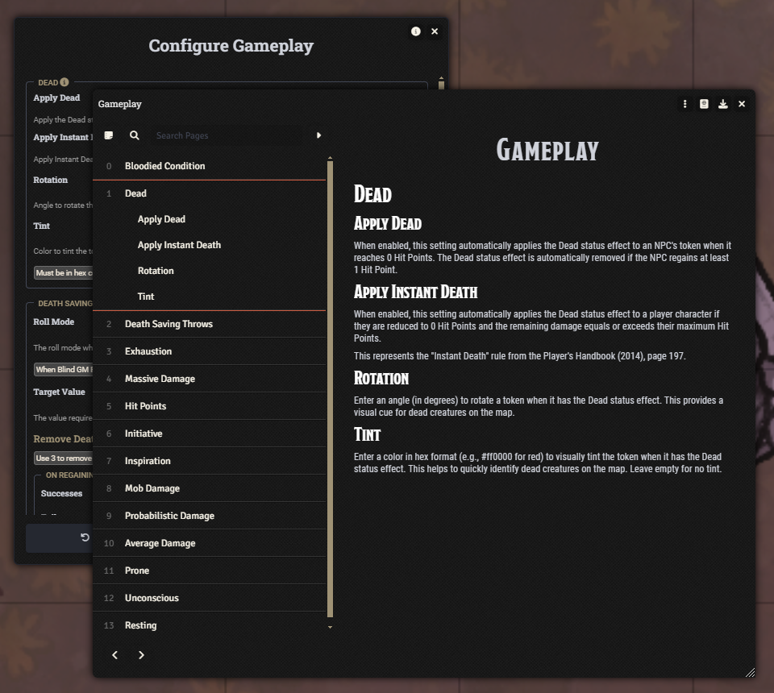
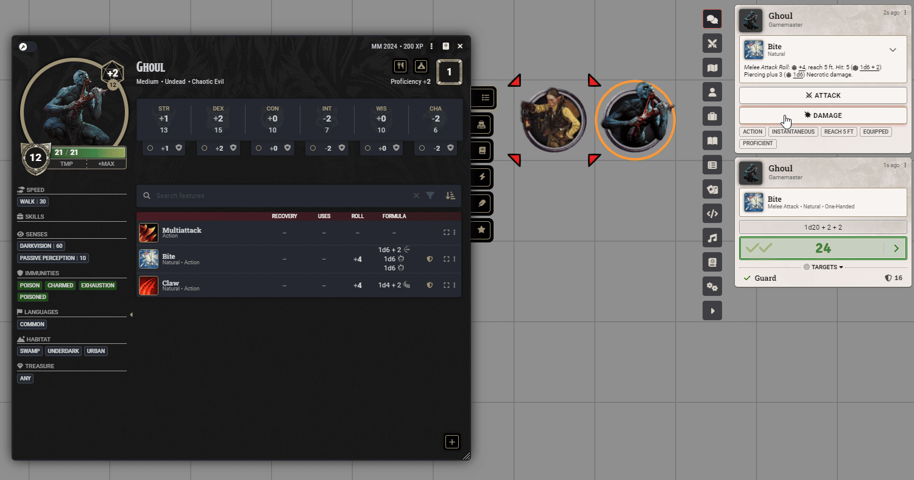
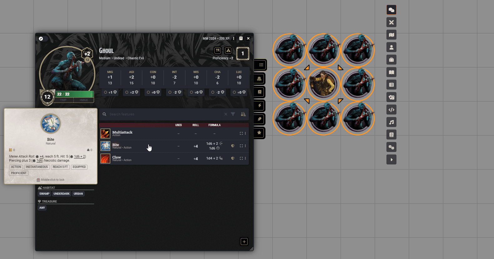
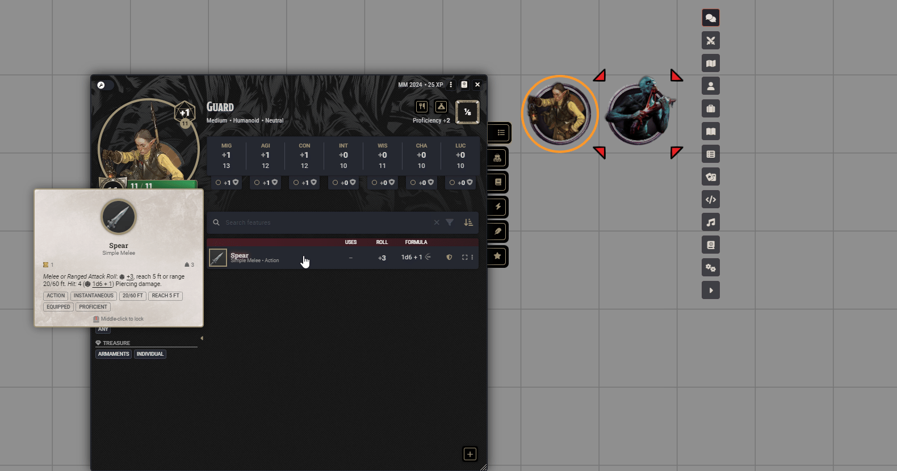
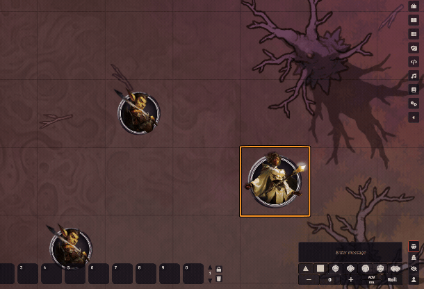
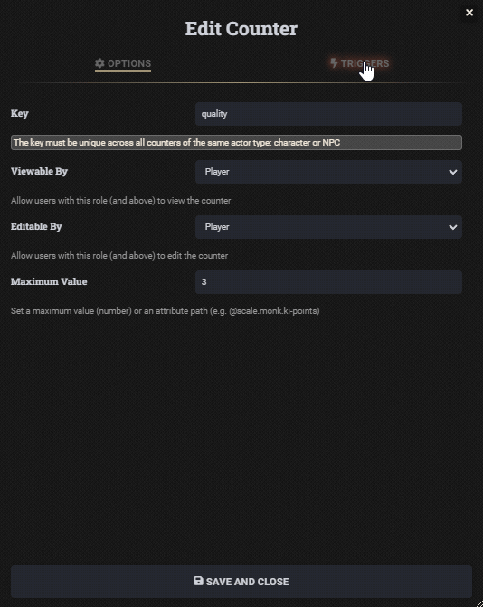
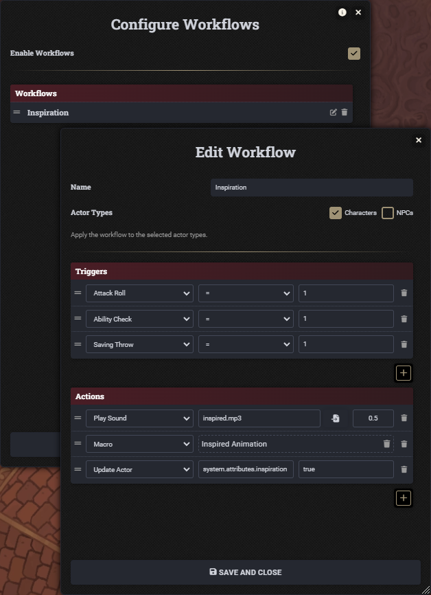
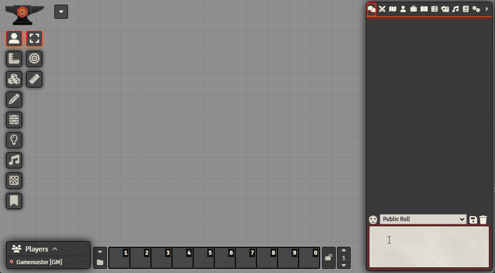
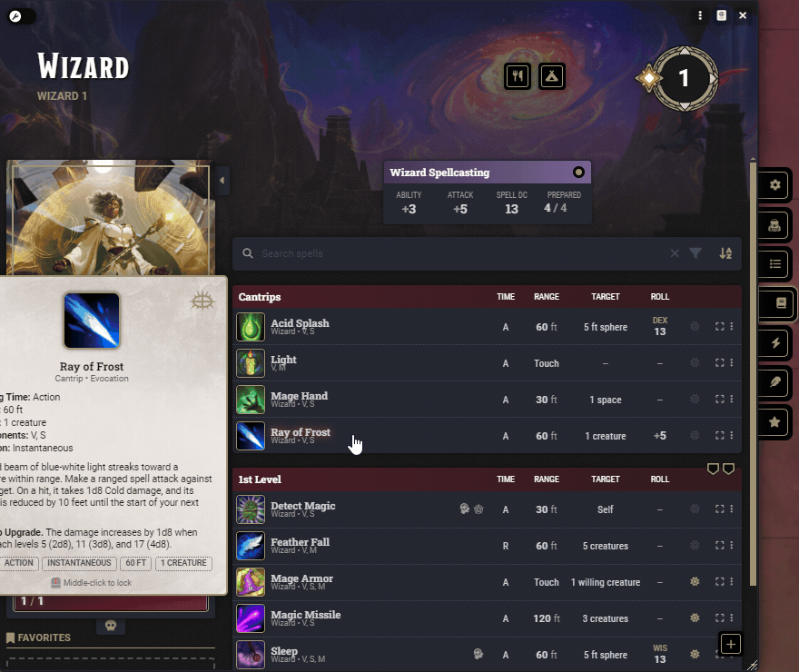
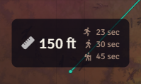

 

# Custom D&D 5e

A Foundry VTT module to customise the D&D 5e system.

## Table of Contents

- [Gameplay](#gameplay)
- [Activities](#activities)
- [Counters](#counters)
- [Workflows](#workflows)
- [Configurations](#configurations)
- [Configure Encumbrance](#configure-encumbrance)
- [Configure Rolls](#configure-rolls)
- [Actor Sheet](#actor-sheet)
- [Item Sheet](#item-sheet)
- [Smaller Form Character Sheet](#smaller-form-character-sheet)
- [Chat Commands](#chat-commands)
- [Show Pressed Keys](#show-pressed-keys)
- [Ruler Travel Time](#ruler-travel-time)
- [Animations](#animations)
- [Radial Status Effects](#radial-status-effects)
- [Token Border Shape](#token-border-shape)
- [Token HUD Improvements](#token-hud-improvements)
- [Apply Elevation to Selected Tokens](#apply-elevation-to-selected-tokens)
- [Toggle Status Effects on Selected Tokens](#toggle-status-effects-on-selected-tokens)
- [Compatibility](#compatibility)
- [Required Modules](#required-modules)

---

## Gameplay

Configure game mechanics and automation of core rules, optional variants and house rules.

For help and advice on gameplay settings, either click the info buttons in the Gameplay window or open the Gameplay journal within the Custom D&D 5e compendium.

    
See Image

### Bloodied
- Apply the Bloodied condition when a character or NPC is reduced to the threshold or lower.
- Customise the Bloodied threshold.
- To stop a character or NPC from gaining the Bloodied condition, add Bloodied to their Condition Immunities.

    
See Video

### Instant Death
Apply Instant Death when a character suffers damage equal to or greater than their remaining HP plus their max HP.

    
See Video

### Dead
- Apply the Dead status effect when an NPC is reduced to zero HP.
- Tint and/or rotate the token when it gains the Dead status effect.

    
See Video

### Unconscious
Apply the Unconscious status effect when a PC is reduced to zero HP.

    
See Video

### Death Saving Throws
- Set the roll mode to Public Roll, Blind GM Roll or Private GM Roll. When using Blind GM Roll, successes and failures will not appear on the character sheet for the player.
- Set the target value required to succeed a death saving throw.
- Remove a number of successes or failures for each event: On Regaining HP from 0, On Short Rest and On Long Rest.

    
See Image

### Hit Points

#### Massive Damage
Apply Massive Damage as per the variant rule (DMG pg. 273).

    
See Video

#### Rolling Hit Points
- When rolling for Hit Points, automatically reroll based on a minimum value.
- Reroll once or until the minimum value is met.
- Hide the Take Average option when rolling for Hit Points.

    
See Image

#### Negative Hit Points
- Apply negative hit points to characters and/or NPCs.
- Choose to heal from negative HP or from 0 HP.

    
See Image

### Initiative Each Round
- **Reroll All:** Reroll Initiative for all combatants at the start of each round.
- **Reset Only:** Reset Initiative for all combatants without rerolling.
- **Reroll NPC:** Reroll Initiative for NPCs only at the start of each round.

    
See Video

### Award Inspiration
Award Inspiration when a set value is rolled for an ability check, attack roll, saving throw and/or skill check.

    
See Image

### Average Damage
- When rolling damage, the average result is used.
- Enable per actor type (Player Characters, NPCs or both).
- When the associated attack roll is a critical hit, the average damage includes the critical damage.

    
See Video

### Mob Damage
- When attacking a single token with four or more identical tokens selected, the attack roll is replaced with a damage roll based on the **Mobs Average Results** table (Dungeon Master's Guide (2024), page 82).
- Use average damage instead of rolling.

    
See Video

### Probabilistic Damage
- When attacking a single token, the attack roll is replaced with a damage roll scaled by the chance to hit.
- Enable per activity and actor type (Player Characters, NPCs or both).
- Use average damage instead of rolling.

    
See Video

    
See Image

### Prone
Rotate the token when it gains the Prone status effect.

    
See Video

### Resting

#### Use Camp Supplies
When taking a Long Rest, optionally requires spending Camp Supplies.

    
See Image

(<a href="#custom-dd-5e">back to top</a>)

---

## Activities

Add custom activity types for features, items and spells, and a targeting prompt that ensures targets are selected before activities proceed.

### Macro Activity

The Macro activity executes a macro when the activity is used. Macros can be configured to run automatically or via a chat card button, and receive context including the actor, token, item, targets and usage configuration.

### Move Activity

The Move activity enables forced movement of targeted tokens on the map. Valid movement positions are highlighted based on direction (push, pull, or any) and distance constraints. Supports gridded and gridless scenes, respects wall collision, and handles multiple targets in sequence.

### Swap Activity

The Swap activity swaps the caster's token position with a target token. Supports range validation, target type restrictions (ally, enemy, willing), size limits, and an optional designated actor. Can be configured as a teleport (instant) or animated movement.

### Targeting Prompt

When enabled, the Targeting Prompt intercepts activity usage and prompts the user to select targets on the map before the activity proceeds. A cursor indicator shows the current and required target count. The prompt activates for standard activities with individual target data, as well as Move and Swap activities.

(<a href="#custom-dd-5e">back to top</a>)

---

## Counters

Add counters to character sheets with four types: checkbox, fraction, number and success/failure. 

Set triggers to automatically change counter values based on HP thresholds, combat events, or item attack rolls. Triggers can execute macros with custom operators. Counter actions include increasing or decreasing values, destroying items, and reducing item quantities. Counters can also be added to items and group actor sheets, and are compatible with Tidy5e character sheets.

    
See Video

(<a href="#custom-dd-5e">back to top</a>)

---

## Workflows

Create event-driven workflows that execute actions in response to triggers. Workflows can be configured at the world level or per actor.

### Triggers

Triggers define when a workflow fires. Multiple triggers can be added to a single workflow using OR logic. Roll-based triggers support optional value conditions with operators (equal, less than, greater than, not equal).

Available triggers: Attack Roll, Ability Check, Saving Throw, Skill Check, Tool Check, Initiative Roll, Concentration Save, Death Save, Damage Roll, Reaches 0 HP, Drops to Half HP or Lower, Loses HP, Gains HP, Start of Combat, End of Combat, Start of Turn, End of Turn, Short Rest, Long Rest.

### Actions

Actions define what happens when a workflow is triggered. Multiple actions can be added to a single workflow.

Available actions: Macro, Play Sound, Apply Condition, Remove Condition, Toggle Condition, Roll Table, Distribute Award, Request Roll, Update Actor, Update Token.

### Per-Actor Workflows

Workflows can also be configured on individual actors via the Configure Workflows button on the Effects tab of the actor sheet. Per-actor workflows follow the same trigger and action system as world workflows.

(<a href="#custom-dd-5e">back to top</a>)

---

## Configurations

Customise D&D 5e system configurations. For help and advice on modifying a configuration, either click the info button in the header of the configuration window or open the Configurations journal within the Custom D&D 5e compendium.

    
See Image

- **Abilities**: Strength, Dexterity, Constitution, etc.
- **Activation Costs**: Action, Bonus Action, Reaction, etc.
- **Actor Sizes**: Tiny, Small, Medium, etc.
- **Armor**: Breastplate, Chain Mail, Leather, etc.
- **Armor Calculations**: Flat, Mage Armor, Unarmored Defense, etc.
- **Armor Proficiencies/Types**: Light, Medium, Heavy, Shields, etc.
- **Bastions**: Facilities, sizes, build orders and subtypes.
- **Calendar**: Custom campaign calendars with months, days and seasons.
- **Conditions/Status Effects**: Blinded, Charmed, Dead, etc. Includes overlay options.
- **Consumable Types**: Ammo, Food, Poison, etc.
- **Creature Types**: Aberration, Beast, Celestial, etc.
- **Currencies**: Copper, Silver, Gold, etc. Includes conversion configuration.
- **Damage Types**: Acid, Bludgeoning, Fire, etc.
- **Encumbrance**: Encumbrance labels, icons, thresholds, weight modifiers, speed multiplier, etc.
- **Equipment Types**: Clothing, Ring, Rod, etc.
- **Feature Types**: Background, Class, Enchantment, etc.
- **Item Properties**: Adamantine, Finesse, Heavy, etc.
- **Item Rarity**: Common, Uncommon, Rare, etc.
- **Languages**: Common, Dwarvish, Elvish, etc.
- **Loot Types**: Art Object, Adventuring Gear, Gemstone, etc.
- **Senses**: Blindsight, Darkvision, Tremorsense, etc.
- **Skills**: Athletics, Acrobatics, Stealth, etc.
- **Spell Schools**: Abjuration, Conjuration, Divination, etc.
- **Tools**: Alchemist's Supplies, Bagpipes, Brewer's Supplies, etc.
- **Tool Proficiencies/Types**: Artisan's Tools, Gaming Set, Musical Instrument, etc.
- **Weapons**: Dagger, Longsword, Shortbow, etc.
- **Weapon Masteries**: Customise weapon mastery effects and labels.
- **Weapon Proficiencies/Types**: Improvised, Simple, Martial, etc.
- **Max Ability Score**
- **Max Level**

(<a href="#custom-dd-5e">back to top</a>)

---

## Configure Encumbrance

Customise encumbrance labels, icons, thresholds and weight modifiers. Includes an optional speed multiplier for encumbrance-based movement reduction.

    
See Image

(<a href="#custom-dd-5e">back to top</a>)

---

## Configure Rolls

Customize the base die and roll mode for Ability Checks, Attack Rolls, Concentration Saving Throws, Initiative Rolls, Saving Throws, Skills Checks and Tool Checks.

    
See Video

(<a href="#custom-dd-5e">back to top</a>)

---

## Actor Sheet

Customise the actor sheet with client and world settings for characters and NPCs.

### Client Settings
- **Sheet Scale:** Change the scale of the character sheet.
- **Auto-Fade:** Automatically fade out the actor sheet when the mouse leaves it.
- **Auto-Minimise:** Automatically minimise the actor sheet when the mouse leaves it.

### Characters
- **Banner Image:** Select an image to use as the banner on the character sheet.
- **Show/Hide Death Saves:** Show or hide death saves tracking on the character sheet.
- **Show/Hide Encumbrance:** Show or hide the encumbrance bar on the character sheet.
- **Show/Hide Exhaustion:** Show or hide exhaustion tracking on the character sheet.
- **Show/Hide Inspiration:** Show or hide the Inspiration button on the character sheet.
- **Show Jump Distance:** Display Long Jump and High Jump distances in the Speed tooltip on character sheets. Shows running and standing variants calculated from the character's Strength score and modifier.
- **Show/Hide Manage Currency:** Show or hide the Manage Currency button on the character sheet.

### NPCs
- **Show Disposition:** Show disposition buttons (Secret, Hostile, Neutral, Friendly) in the NPC sheet sidebar for quick token disposition changes.
- **Show/Hide Legendary Actions:** Show or hide Legendary Actions on the NPC sheet.
- **Show/Hide Legendary Resistance:** Show or hide Legendary Resistance on the NPC sheet.
- **Show/Hide Use Lair Action:** Show or hide the Use Lair Action button on the NPC sheet.

(<a href="#custom-dd-5e">back to top</a>)

---

## Item Sheet

Set the minimum role required to toggle Identified/Unidentified on the item.

(<a href="#custom-dd-5e">back to top</a>)

---

## Smaller Form Character Sheet

Select 'Custom D&D 5e Character Sheet' from the Sheet Configuration dialog (cog on the sheet's header) to enable a smaller form character sheet.

    
See Image

(<a href="#custom-dd-5e">back to top</a>)

---

## Chat Commands

Enable additional chat commands to roll an attack, roll damage or request checks and saving throws. For a list of available commands, view the **Chat Commands** journal within the **Custom D&D 5e** compendium.

    
See Video

(<a href="#custom-dd-5e">back to top</a>)

---

## Show Pressed Keys

Display an icon near the cursor when the Skip Dialog, Advantage or Disadvantage keys are pressed.

    
See Video

(<a href="#custom-dd-5e">back to top</a>)

---

## Ruler Travel Time

When measuring distances with the ruler tool, travel time estimates are displayed for three D&D 5e travel paces: fast, normal and slow. Times are shown in days, hours and minutes, calculated based on standard 8-hour travel days.

When the ruler is started from a hovered token, the travel time is based on the token's current movement action (Walk, Fly, Swim, etc.) and speed. When started from empty space, the standard 30 feet per round speed is used.

    
See Image

(<a href="#custom-dd-5e">back to top</a>)

---

## Animations

Screen animations can be triggered via the module API or socket events. Available animations include Splatter, Light Rays, Color Split and Wave. Animations can also be triggered automatically for events such as Massive Damage and Inspiration.

    
See Video

(<a href="#custom-dd-5e">back to top</a>)

---

## Radial Status Effects

Display status effects in a circle around the token.

    
See Image

(<a href="#custom-dd-5e">back to top</a>)

---

## Token Border Shape

Choose the shape of the token's border when it is selected or hovered.

    
See Image

(<a href="#custom-dd-5e">back to top</a>)

---

## Token HUD Improvements

Improves the Token HUD with hover-to-open palettes, button styling, and fixed HUD size across zoom levels.

- **Hover-to-open palettes:** Hovering over the Status Effects or Movement Actions buttons opens the palette automatically.
- **Button styling:** Enhanced visual feedback for status effect icons and control buttons.
- **Fixed HUD size:** The Token HUD maintains a consistent size on screen regardless of the canvas zoom level.

(<a href="#custom-dd-5e">back to top</a>)

---

## Apply Elevation to Selected Tokens

Apply elevation to all selected tokens.

    
See Video

(<a href="#custom-dd-5e">back to top</a>)

---

## Toggle Status Effects on Selected Tokens

Toggle status effects on all selected tokens.

    
See Video

(<a href="#custom-dd-5e">back to top</a>)

---

## Compatibility
### Variant Encumbrance + Midi
Custom D&D 5e will defer to the [Variant Encumbrance + Midi](https://foundryvtt.com/packages/variant-encumbrance-dnd5e) module for encumbrance configuration when it is active.

(<a href="#custom-dd-5e">back to top</a>)

---

## Required Modules
### [libWrapper](https://foundryvtt.com/packages/lib-wrapper)
For developers, LibWrapper is used to patch:
- **`CONFIG.Actor.documentClass.prototype._prepareMovementAttribution`:** Patched when 'Show Jump Distance' is enabled. Appends Long Jump and High Jump distances to the movement tooltip for characters.
- **`CONFIG.Canvas.rulerClass.prototype._getWaypointLabelContext`:** Patched when 'Ruler Travel Time' is enabled. Adds travel time estimates to ruler waypoint labels.
- **`CONFIG.Dice.D20Die.prototype.applyAdvantage`**: Patched when at least one roll is configured. Replaces roll formula to allow different numbers and faces of dice.
- **`CONFIG.Dice.D20Roll.fromConfig`**: Patched when at least one roll is configured. Replaces the d20 die formula with the custom die formula.
- **`CONFIG.Dice.D20Roll.prototype.configureModifiers`**: Patched when at least one roll is configured. Adds the custom die formula to the d20 options to make it available to `validD20Roll`.
- **`CONFIG.Dice.D20Roll.prototype.validD20Roll`**: Patched when at least one roll is configured. Additionally returns true when a custom die exists.
- **`dnd5e.applications.actor.BaseActorSheet.prototype._prepareSenses`:** Patched when senses configuration is enabled. Applies custom senses modifications.
- **`dnd5e.applications.actor.BaseActorSheet.prototype._prepareSkillsTools`:** Patched when skills configuration is enabled. Filters out skills not present in CONFIG.DND5E.skills to prevent errors when skills are injected by the system.
- **`dnd5e.dataModels.actor.AttributesFields.prepareEncumbrance`:** Patched when the D&D 5e's 'Encumbrance Tracking' setting is set to 'Variant'. Avoids recalculating encumbrance as well as issues with encumbrance active effects applied during item updates/deletions.
- **`dnd5e.dataModels.actor.AttributesFields.prepareMovement`:** Patched when encumbrance speed reduction mode is set to 'Multiplier'. Applies multiplier-based speed reductions to movement values.
- **`foundry.canvas.placeables.Token.prototype._refreshBorder`:** Patched when Custom D&D 5e's 'Token Border Shape' setting is enabled.
- **`foundry.canvas.placeables.Token.prototype._refreshEffects`:** Patched when Custom D&D 5e's 'Radial Status Effects' setting is enabled.

(<a href="#custom-dd-5e">back to top</a>)

