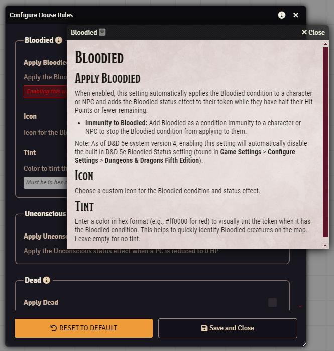
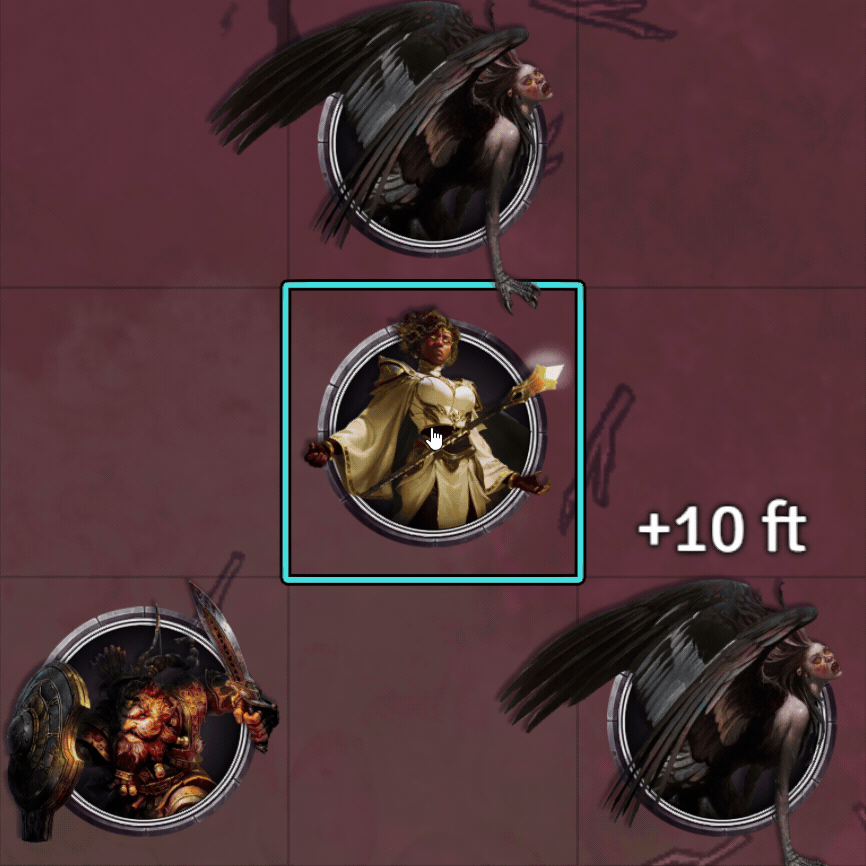
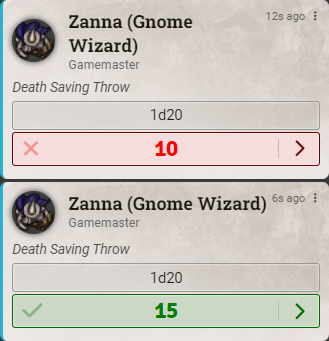
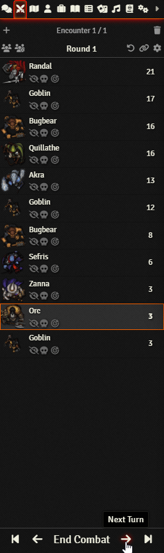
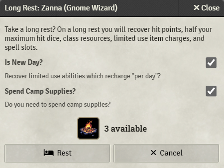
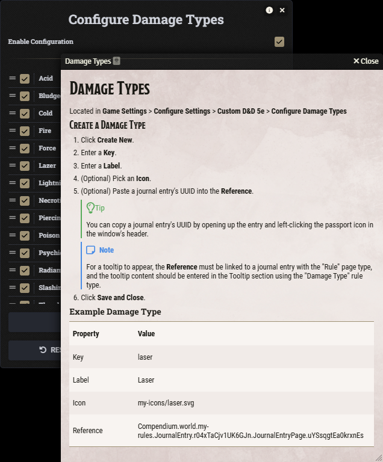
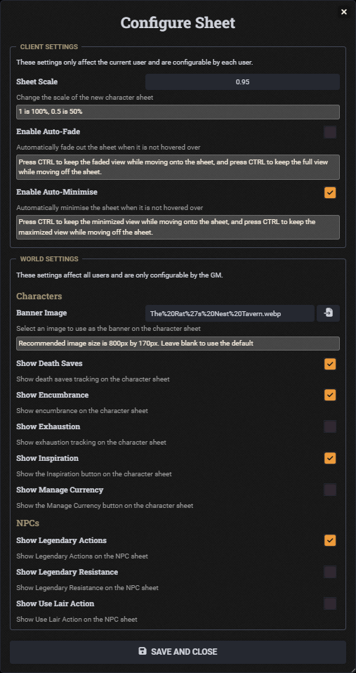
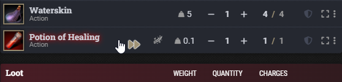
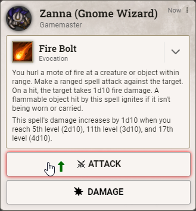
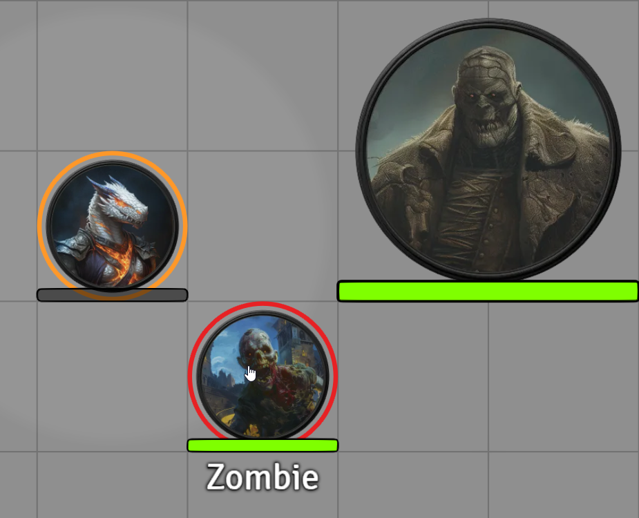

 

# Custom D&D 5e

A Foundry VTT module to customise the D&D 5e system.

# House Rules
For help and advice on the house rules, either click the info buttons in the Configure House Rules window or open the House Rules journal within the Custom D&D 5e compendium.

    
See Image

## Bloodied
- Apply the Bloodied condition when a character or NPC is reduced to half HP or lower.
- To stop a character or NPC from gaining the Bloodied condition, add Bloodied to their Condition Immunities.

    
See Video

## Instant Death
Apply Instant Death when a character suffers damage equal to or greater than their remaining HP plus their max HP.

    
See Video

## Dead
- Apply the Dead status effect when an NPC is reduced to zero HP.
- Tint and/or rotate the token when it gains the Dead status effect.

    
See Video

## Unconscious
Apply the Unconscious status effect when a PC is reduced to zero HP.

    
See Video

## Death Saving Throws
- Set the roll mode to Public Roll, Blind GM Roll or Private GM Roll. When using Blind GM Roll, successes and failures will not appear on the character sheet for the player.
- Set the target value required to succeed a death saving throw.
- Remove a number of successes or failures for each event: On Regaining HP from 0, On Short Rest and On Long Rest.

    
See Image

## Hit Points
### Massive Damage
Apply Massive Damage as per the variant rule (DMG pg. 273).

    
See Video

### Rolling Hit Points
- When rolling for Hit Points, automatically reroll based on a minimum value.
- Reroll once or until the minimum value is met.
- Hide the Take Average option when rolling for Hit Points.
- Roll Hit Points for NPCs when dragging their token onto the canvas.

    
See Image

### Negative Hit Points
- Apply negative hit points.
- Choose to heal from negative HP or from 0 HP.

    
See Image

## Reroll Initiative Each Round
Reroll Initiative for all combatants at the start of each round.

    
See Video

## Award Inspiration
Award Inspiration when a set value is rolled for an ability check, attack roll, saving throw and/or skill check.

    
See Image

## Prone
Rotate the token when it gains the Prone status effect.

    
See Video

## Resting
### Use Camp Supplies
When taking a Long Rest, optionally requires spending Camp Supplies.

    
See Image

## Counters
**Counter Types:** Add four types of counter to the character sheets: checkbox, fraction, number and success/failure.

**Triggers:** Set triggers to automatically change a counter value when an actor hits 0 HP, half HP, or when combat ends if they hit 0 HP any time during combat. Set a trigger to automatically make an actor dead when a counter hits a defined value.

    
See Video

    
See Image

## Smaller Form Character Sheet
Select 'Custom D&D 5e Character Sheet' from the Sheet Configuration dialog (cog on the sheet's header) to enable a smaller form character sheet.

    
See Image

## Configurations
For help and advice on modifying a configuration, either click the info button in the header of the configuration window or open the Configurations journal within the Custom D&D 5e compendium.

    
See Image

- Configure abilities, activation costs (dnd5e 4+ only), actor sizes, armor, armor calculations, armor proficiencies, conditions, consumable types, currencies, damage types, encumbrance, item action types (dnd5e 3 only), item activation cost types (dnd5e 3 only), item properties, item rarity, languages, senses, skills, spell schools, tools, weapons, weapon proficiencies, and max level. 

## Configure Encumbrance

    
See Image

## Configure Rolls
Customize the base die and roll mode for Ability Checks, Attack Rolls, Concentration Saving Throws, Initiative Rolls, Saving Throws, Skills Checks and Tool Checks.

    
See Video

## Configure Sheet
- Auto-fade or auto-minimise the sheet when it's not hovered over.
- Scale the new character sheet up or down.
- Change the banner at the top of the sheet.
- Hide death saves, encumbrance, exhaustion, inspiration, the Manage Currency button, Legendary Actions, Legendary Resistances and Use Lair Action.

    
See Image

## Show Pressed Keys
Display an icon near the cursor when the Skip Dialog, Advantage or Disadvantage keys are pressed.

    
See Image

## Radial Status Effects
Display status effects in a circle around the token.

    
See Image

## Token Border Shape
Choose the shape of the token's border when it is selected or hovered.

    
See Image

## Apply Elevation to Selected Tokens
- Apply elevation to all selected tokens.

    
See Video

## Toggle Status Effects on Selected Tokens
- Toggle status effects on all selected tokens.

    
See Video

## Compatibility
### Variant Encumbrance + Midi
Custom D&D 5e will defer to the [Variant Encumbrance + Midi](https://foundryvtt.com/packages/variant-encumbrance-dnd5e) module for encumbrance configuration when it is active.

## Required Modules
### [libWrapper](https://foundryvtt.com/packages/lib-wrapper)
For developers, LibWrapper is used to patch:
- **`Application.prototype._render`:** Allows adding data to the character sheets without editing the HTML. This should no longer be required with the release of Application V2.
- **`CONFIG.Actor.documentClass.prototype._prepareEncumbrance`:** Patched when the D&D 5e's 'Encumbrance Tracking' setting is set to 'Variant'. Avoids recalculating encumbrance as well as issues with encumbrance active effects applied during item updates/deletions.
- **`CONFIG.Dice.D20Die.prototype.applyAdvantage`**: Patched when at least one roll is configured. Replaces roll formula to allow different numbers and faces of dice.
- **`CONFIG.Dice.D20Roll.fromConfig`**: Patched when at least one roll is configured. Replaces the d20 die formula with the custom die formula.
- **`CONFIG.Dice.D20Roll.prototype.configureModifiers`**: Patched when at least one roll is configured. Adds the custom die formula to the d20 options to make it available to `validD20Roll`.
- **`CONFIG.Dice.D20Roll.prototype.validD20Roll`**: Patched when at least one roll is configured. Additionally returns true when a custom die exists.
- **`Token.prototype._refreshEffects`:** Patched when Custom D&D 5e's 'Radial Status Effects' setting is enabled.
- **`Token.prototype._drawEffect`:** Patched when Custom D&D 5e's 'Radial Status Effects' setting is enabled.
- **`Token.prototype._drawOverlay`:** Patched when Custom D&D 5e's 'Radial Status Effects' setting is enabled.

## Credits
The Radial Status Effects feature is a modification of code developed by [Dorako](https://github.com/Dorako) under the MIT License, which is reproduced here: [Licence](./scripts/radial-status-effects.js)