 

# Custom D&D 5e

A Foundry VTT module to customise the D&D 5e system.

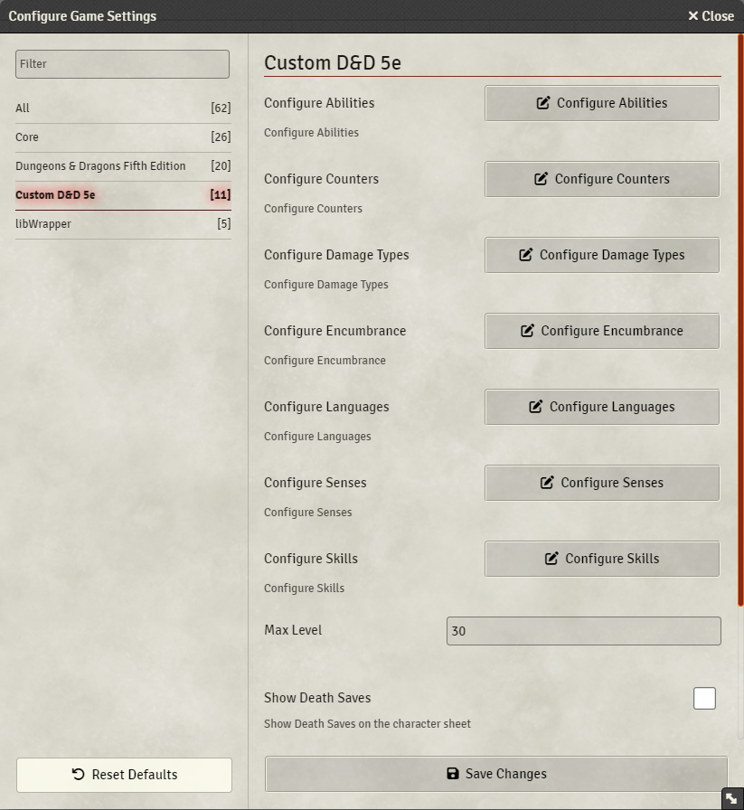
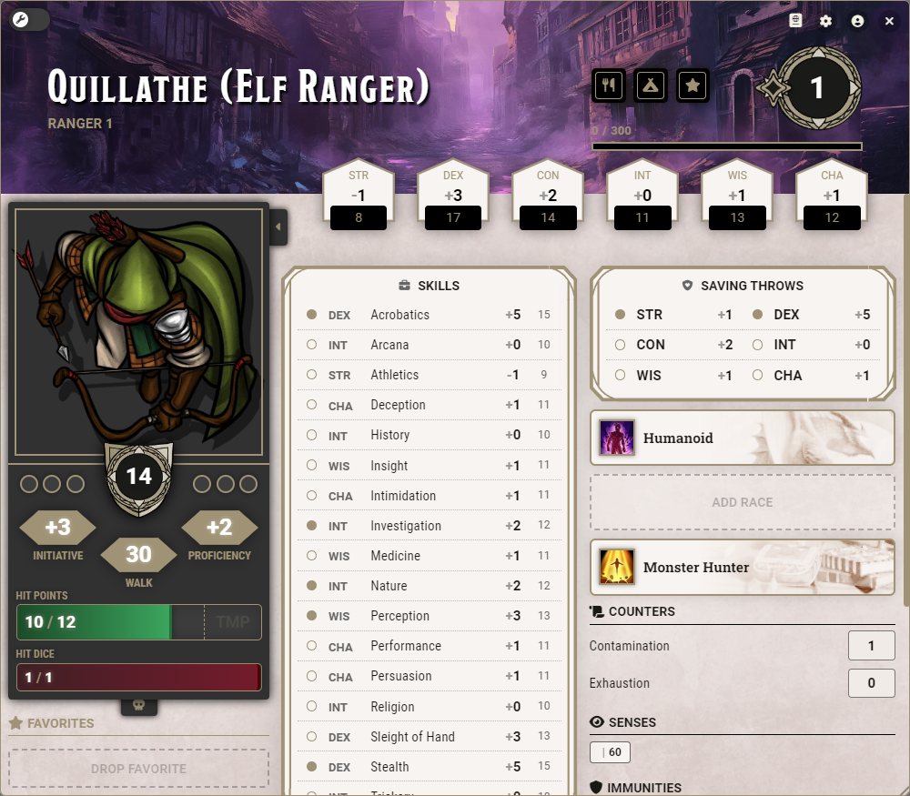

# House Rules
## Bloodied
- Apply the Bloodied condition when a character or NPC is reduced to half HP or lower.
- To stop a character or NPC from gaining the Bloodied condition, add Bloodied to their Condition Immunities.

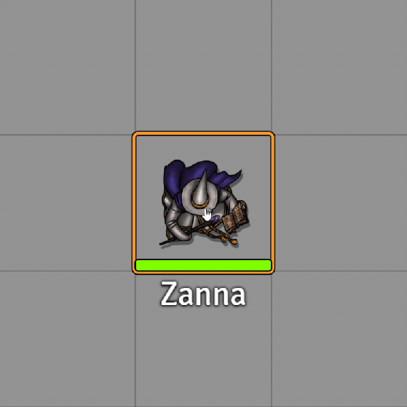

## Instant Death
- Apply Instant Death when a character suffers damage equal to or greater than their remaining HP plus their max HP.

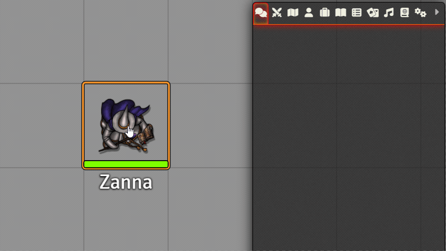

## Dead Status
- Tint and/or rotate the token when it gains the Dead status effect.

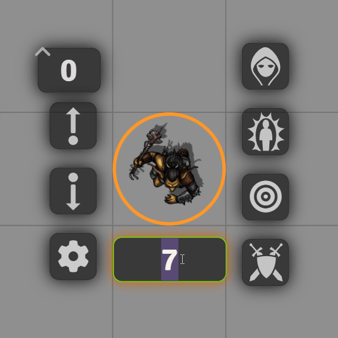

## Death Saving Throws
- Set the roll mode to Public Roll, Blind GM Roll or Private GM Roll. When using Blind GM Roll, successes and failures will not appear on the character sheet for the player.
- Remove a number of successes or failures for each event: On Regaining HP from 0, On Short Rest and On Long Rest.

## Hit Points
### Rolling Hit Points
- When rolling for Hit Points, automatically reroll based on a minimum value.
- Reroll once or until the minimum value is met.
- Hide the Take Average option when rolling for Hit Points.

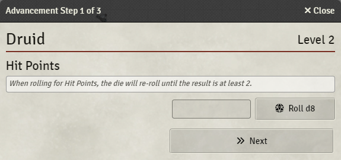

### Massive Damage
- Apply Massive Damage as per the variant rule (DMG pg. 273).

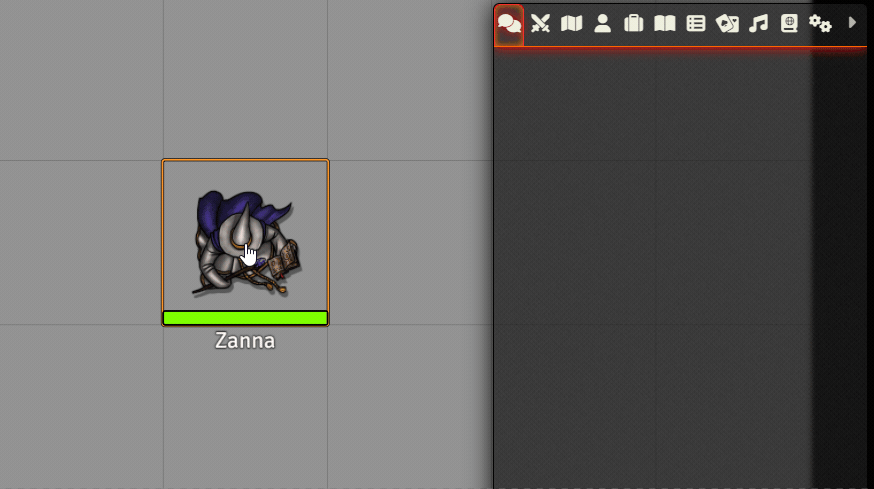

### Negative Hit Points
- Apply negative hit points.
- Choose to heal from negative HP or from 0 HP.

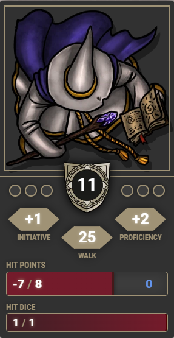

### Inspiration
- Award Inspiration when a set value is rolled for an ability check, attack roll, saving throw and/or skill check.

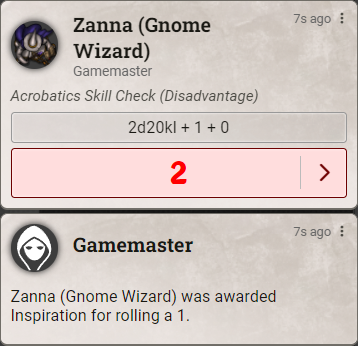

### Prone Status
- Rotate the token when it gains the Prone status effect.

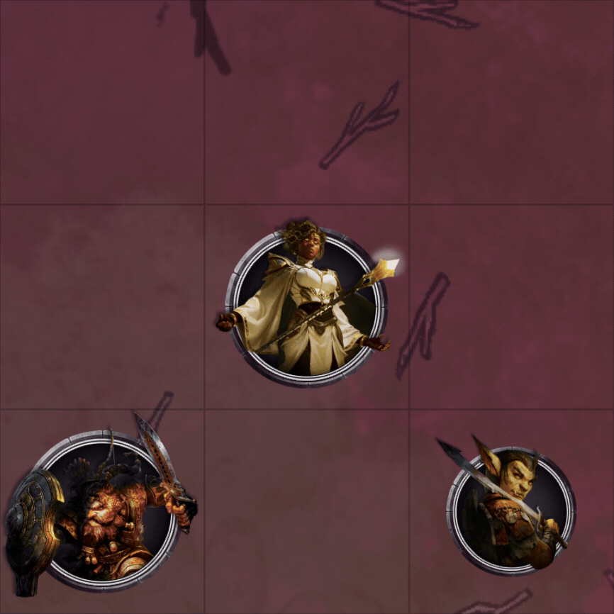

## Counters
**Counter Types:** Add four types of counter to the character sheets: checkbox, fraction, number and success/failure.

**Triggers:** Set triggers to automatically change a counter value when an actor hits 0 HP, half HP, or when combat ends if they hit 0 HP any time during combat. Set a trigger to automatically make an actor dead when a counter hits a defined value.

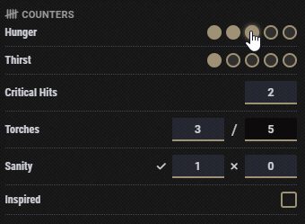
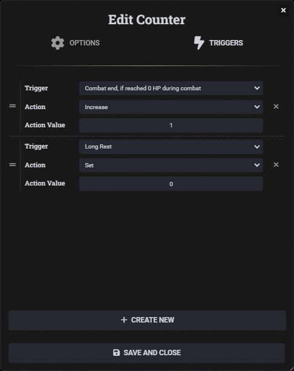

## Smaller Form Character Sheet
Select 'Custom D&D 5e Character Sheet' from the Sheet Configuration dialog (cog on the sheet's header) to enable a smaller form character sheet.
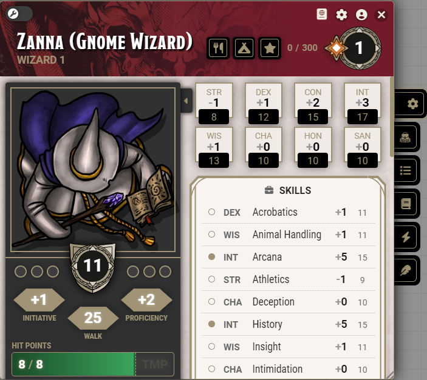

## Configurations
- Configure abilities, actor sizes, armor calculations, currencies, damage types, encumbrance, item action types, item activation cost types, item properties, item rarity, languages, senses, skills, spell schools and max level.

## Configure Encumbrance
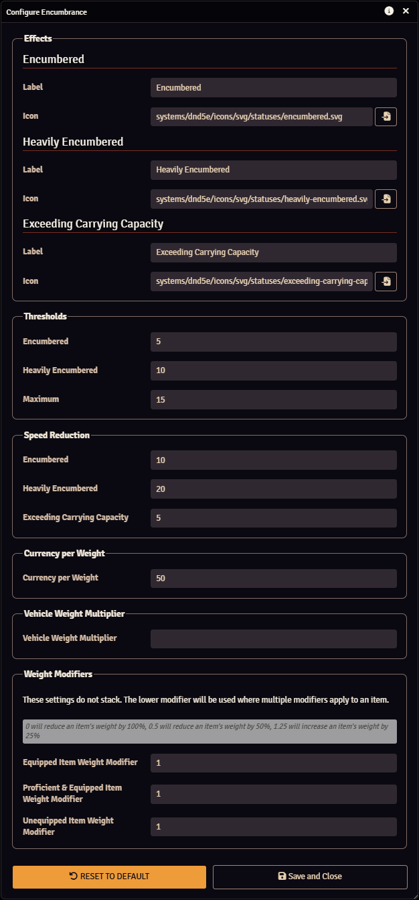

## Configure Sheet
- Auto-fade or auto-minimise the sheet when it's not hovered over.
- Scale the new character sheet up or down.
- Change the banner at the top of the sheet.
- Hide death saves, encumbrance, exhaustion, inspiration, the Manage Currency button, Legendary Actions, Legendary Resistances and Use Lair Action.

## Radial Status Effects
- Display status effects in a circle around the token.

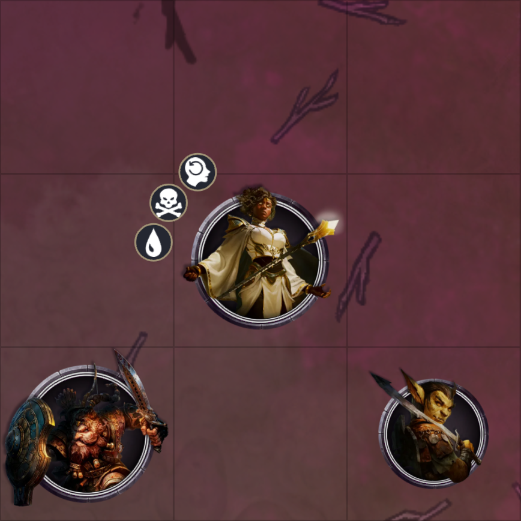

## Apply Elevation to Selected Tokens
- Apply elevation to all selected tokens.

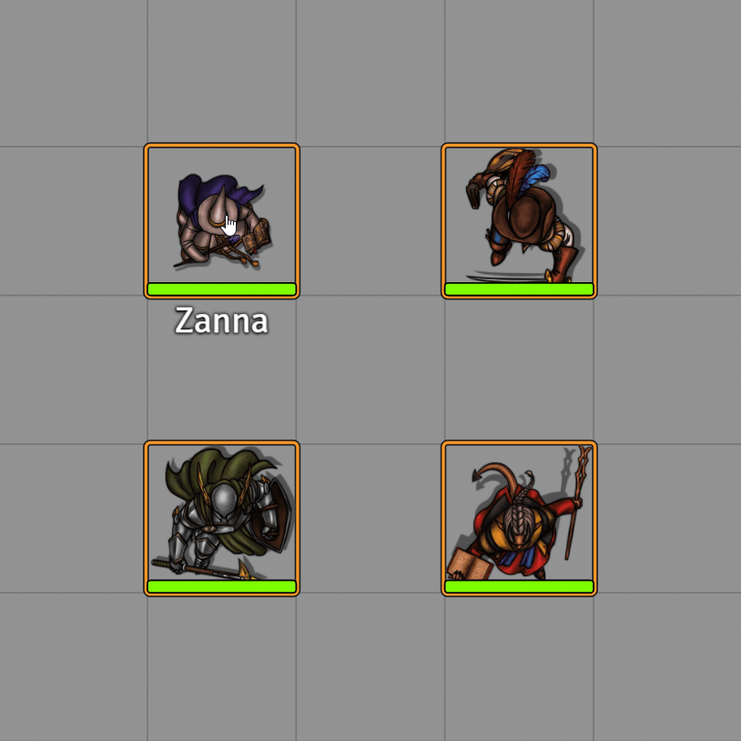

## Toggle Status Effects on Selected Tokens
- Toggle status effects on all selected tokens.

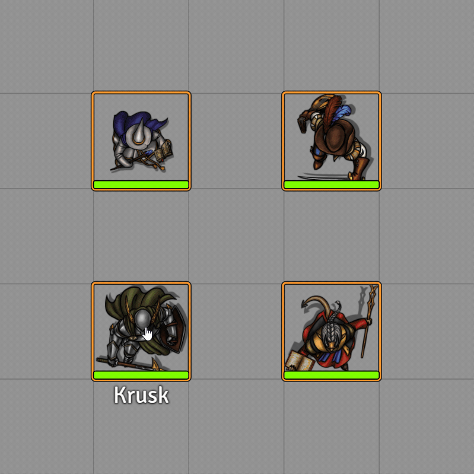

## Compatibility
### Variant Encumbrance + Midi
Custom D&D 5e will defer to the [Variant Encumbrance + Midi](https://foundryvtt.com/packages/variant-encumbrance-dnd5e) module for encumbrance configuration when it is active.

## Wishlist
- Add common house rules.
- Add more versatile encumbrance options.
- Support all dnd5e configurations.

## Required Modules
### [libWrapper](https://foundryvtt.com/packages/lib-wrapper)
For developers, LibWrapper is used to patch:
- **`Application.prototype._render`:** Allows adding data to the character sheets without editing the HTML. This should no longer be required with the release of Application V2.
- **`CONFIG.Actor.documentClass.prototype._prepareEncumbrance`:** When the D&D 5e's 'Encumbrance Tracking' setting is set to 'Variant', avoids recalculating encumbrance as well as issues with encumbrance active effects applied during item updates/deletions.
- **`Token.prototype._refreshEffects`:** When Custom D&D 5e's 'Radial Status Effects' setting is enabled.
- **`Token.prototype._drawEffect`:** When Custom D&D 5e's 'Radial Status Effects' setting is enabled.
- **`Token.prototype._drawOverlay`:** When Custom D&D 5e's 'Radial Status Effects' setting is enabled.

## Credits
The Radial Status Effects feature is a modification of code developed by [Dorako](https://github.com/Dorako) under the MIT License, which is reproduced here: [Licence](./scripts/radial-status-effects.js)