
  

# Custom D&D 5e

A Foundry VTT module to customise the D&D 5e system.

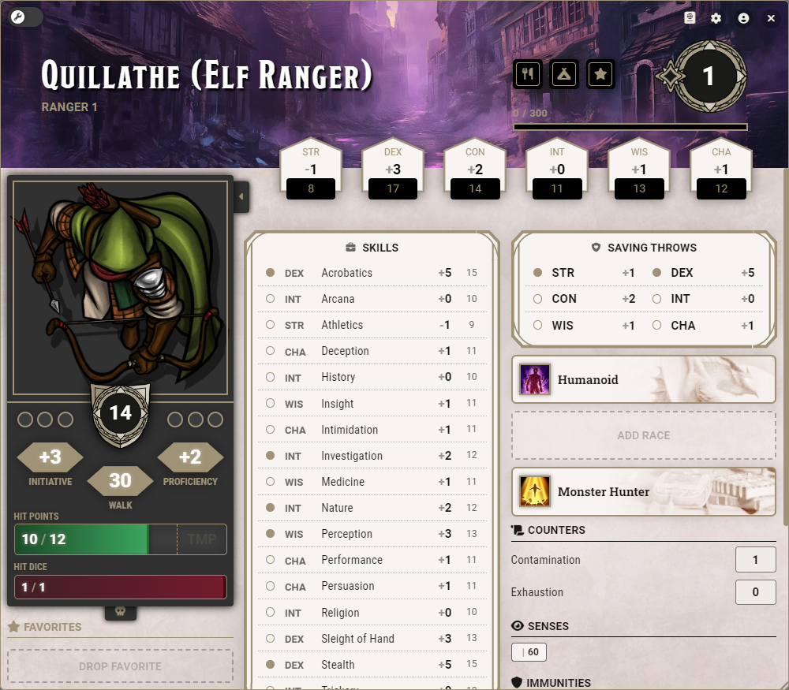

## Licence & Usage

This module references Font Awesome Pro icons under a personal licence. The code in this repository is not licensed for redistribution. This module is designed for use with Foundry VTT V12/V13/V14 only.

For full attribution and licensing details, see [ATTRIBUTION.md](ATTRIBUTION.md).

## Table of Contents

- [Gameplay](#gameplay)
- [Activities](#activities)
- [Counters](#counters)
- [Workflows](#workflows)
- [Configurations](#configurations)
- [Configure Encumbrance](#configure-encumbrance)
- [Configure Interface](#configure-interface)
- [Configure Rolls](#configure-rolls)
- [Actor Sheet](#actor-sheet)
- [Item Sheet](#item-sheet)
- [Item Interactions](#item-interactions)
- [Smaller Form Character Sheet](#smaller-form-character-sheet)
- [Chat Commands](#chat-commands)
- [Show Pressed Keys](#show-pressed-keys)
- [Ruler Travel Time](#ruler-travel-time)
- [Animations](#animations)
- [Radial Status Effects](#radial-status-effects)
- [Condition Levels](#condition-levels)
- [Token Border Shape](#token-border-shape)
- [Token Distance](#token-distance)
- [Token HUD Improvements](#token-hud-improvements)
- [Apply Elevation to Selected Tokens](#apply-elevation-to-selected-tokens)
- [Toggle Status Effects on Selected Tokens](#toggle-status-effects-on-selected-tokens)
- [Compatibility](#compatibility)
- [Required Modules](#required-modules)

---

## Gameplay

Configure game mechanics and automation of core rules, optional variants and house rules.

For help and advice on gameplay settings, either click the info buttons in the Gameplay window or open the Gameplay journal within the Custom D&D 5e compendium.

    
See Image

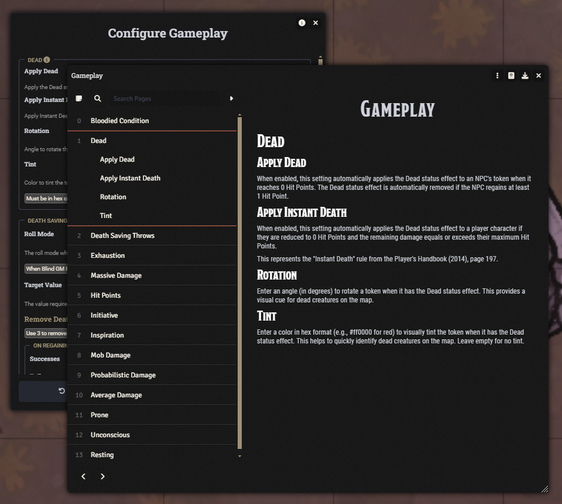

### Bloodied
- Apply the Bloodied condition when a character or NPC is reduced to the threshold or lower.
- Customise the Bloodied threshold.
- To stop a character or NPC from gaining the Bloodied condition, add Bloodied to their Condition Immunities.

    
See Video

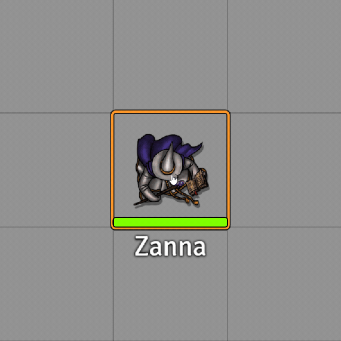

### Instant Death
Apply Instant Death when a character suffers damage equal to or greater than their remaining HP plus their max HP.

    
See Video

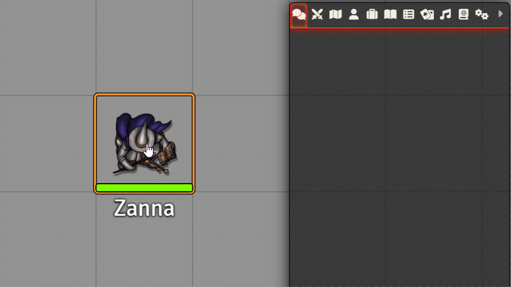

### Dead
- Apply the Dead status effect when an NPC is reduced to zero HP.
- Tint and/or rotate the token when it gains the Dead status effect.

    
See Video

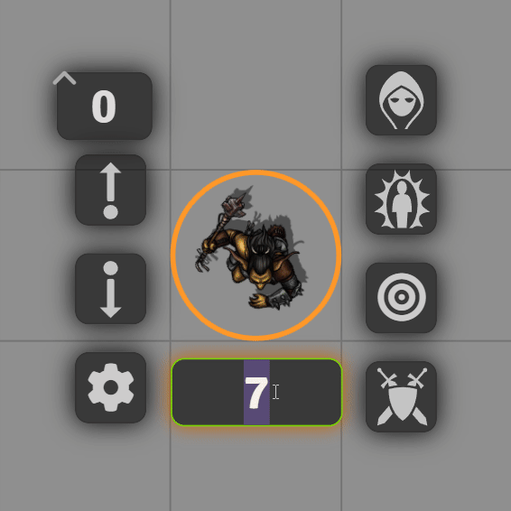

### Unconscious
Apply the Unconscious status effect when a PC is reduced to zero HP.

    
See Video

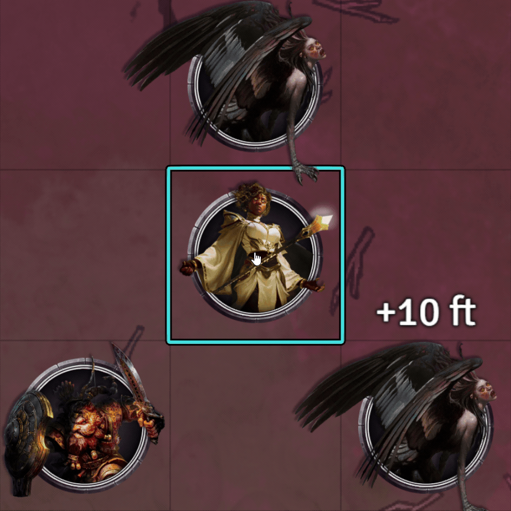

### Death Saving Throws
- Set the roll mode to Public Roll, Blind GM Roll or Private GM Roll. When using Blind GM Roll, successes and failures will not appear on the character sheet for the player.
- Set the target value required to succeed a death saving throw.
- Remove a number of successes or failures for each event: On Regaining HP from 0, On Short Rest and On Long Rest.

    
See Image

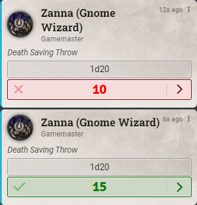

### Hit Points

#### Massive Damage
Apply Massive Damage as per the variant rule (DMG pg. 273).

    
See Video

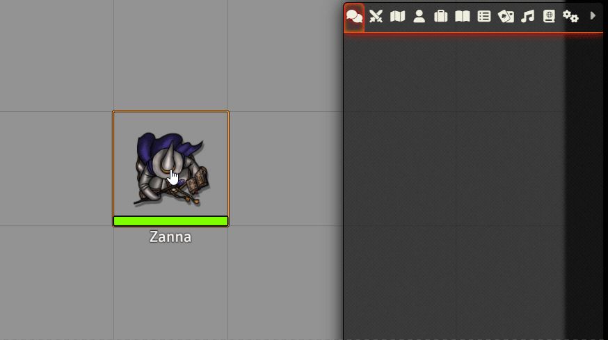

#### Rolling Hit Points
- When rolling for Hit Points, automatically reroll based on a minimum value.
- Reroll once or until the minimum value is met.
- Hide the Take Average option when rolling for Hit Points.

    
See Image

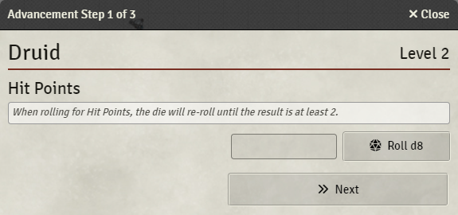

#### Negative Hit Points
- Apply negative hit points to characters and/or NPCs.
- Choose to heal from negative HP or from 0 HP.

    
See Image

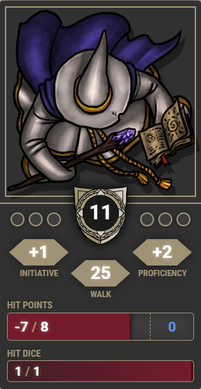

### Initiative Each Round
- **Reroll All:** Reroll Initiative for all combatants at the start of each round.
- **Reset Only:** Reset Initiative for all combatants without rerolling.
- **Reroll NPC:** Reroll Initiative for NPCs only at the start of each round.

    
See Video

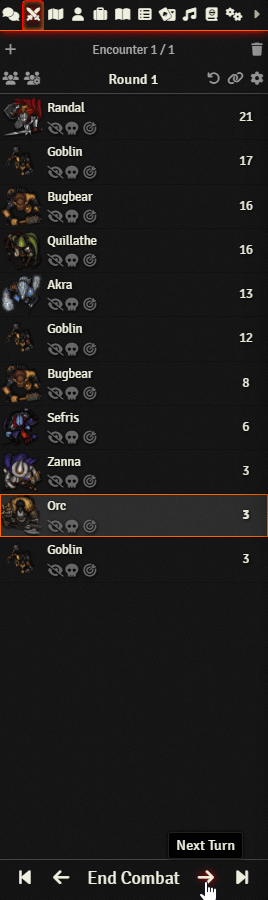

### Speed Factor Initiative
Replace the standard initiative method with the Speed Factor Initiative variant (Dungeon Master's Guide (2014), pg. 270). Each round, every combatant chooses one or more actions, then initiative is rolled for everyone with a modifier based on the creature's size and their chosen action(s). Choices are hidden until initiative is rolled, then revealed.
- **Size:** Configure size modifiers for each creature.
- **Actions:** Configure the available actions and their initiative modifiers.
- **Spells:** Display spells available to the active combatant.
- **Weapons:** Configure modifiers for each weapon and, optionally, display only the weapons available to the active combatant.

    
See Video

### Award Inspiration
Award Inspiration when a set value is rolled for an ability check, attack roll, saving throw and/or skill check.

    
See Image

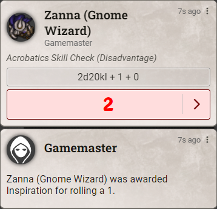

### Average Damage
- When rolling damage, the average result is used.
- Enable per actor type (Player Characters, NPCs or both).
- When the associated attack roll is a critical hit, the average damage includes the critical damage.

    
See Video

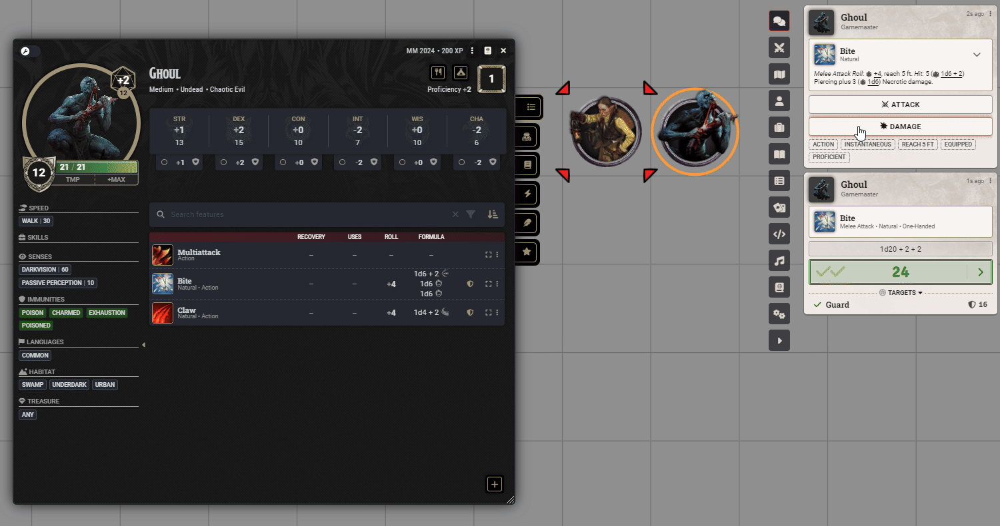

### Mob Damage
- When attacking a single token with four or more identical tokens selected, the attack roll is replaced with a damage roll based on the **Mobs Average Results** table (Dungeon Master's Guide (2024), page 82).
- Use average damage instead of rolling.

    
See Video

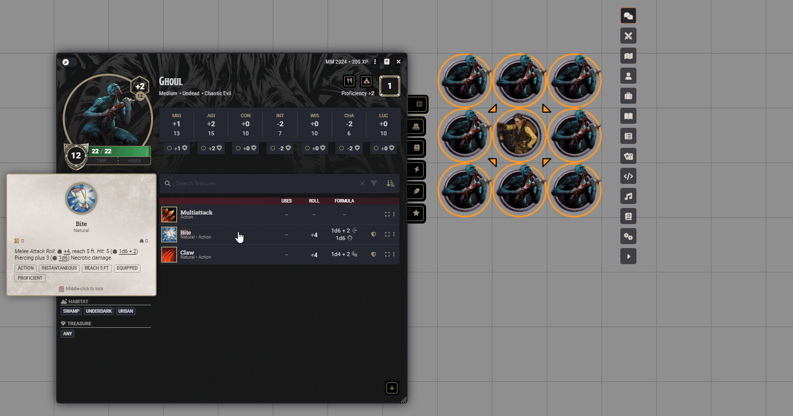

### Probabilistic Damage
- When attacking a single token, the attack roll is replaced with a damage roll scaled by the chance to hit.
- Enable per activity and actor type (Player Characters, NPCs or both).
- Use average damage instead of rolling.

    
See Video

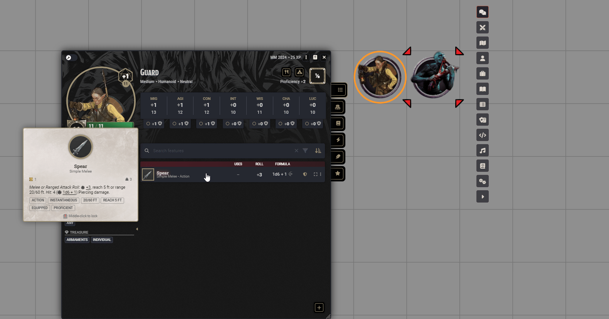

    
See Image

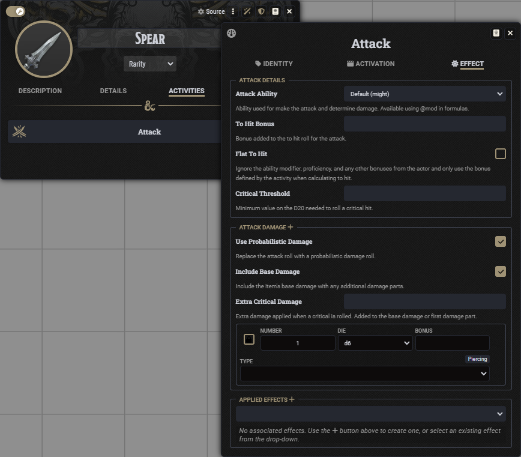

### Prone
Rotate the token when it gains the Prone status effect.

    
See Video

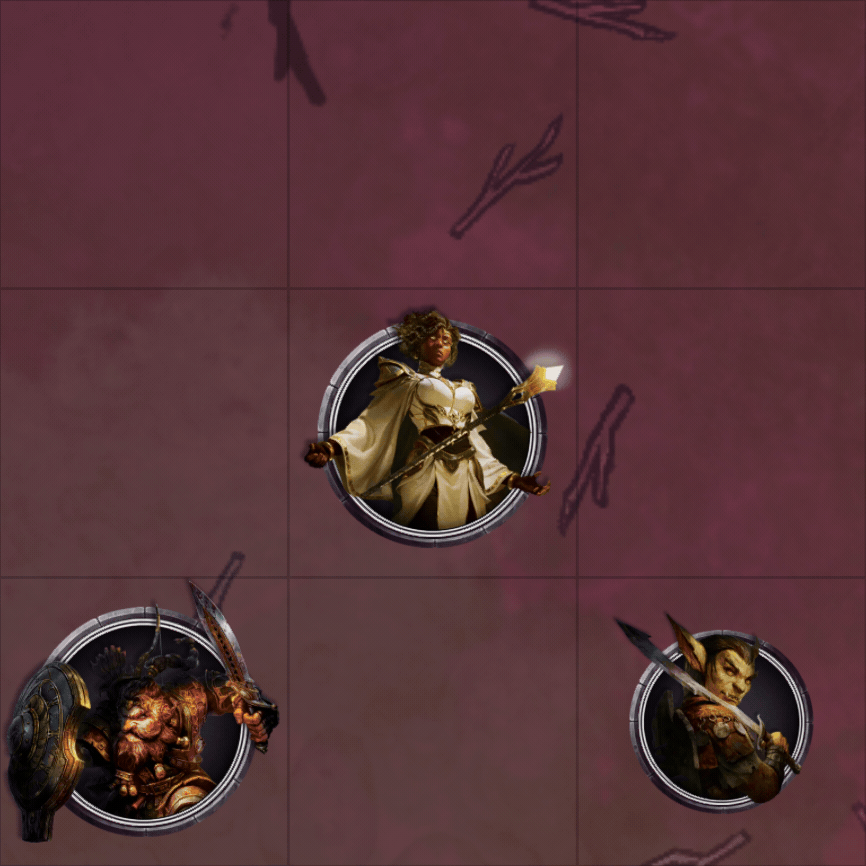

### Resting

#### Use Camp Supplies
When taking a Long Rest, optionally requires spending Camp Supplies.

    
See Image

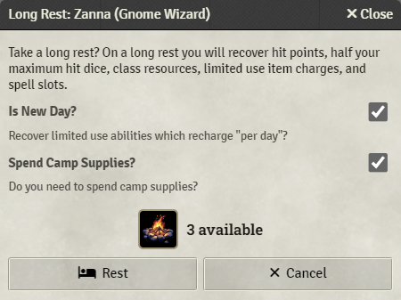

(<a href="#custom-dd-5e">back to top</a>)

---

## Activities

Add custom activity types for features, items and spells, and a targeting prompt that ensures targets are selected before activities proceed.

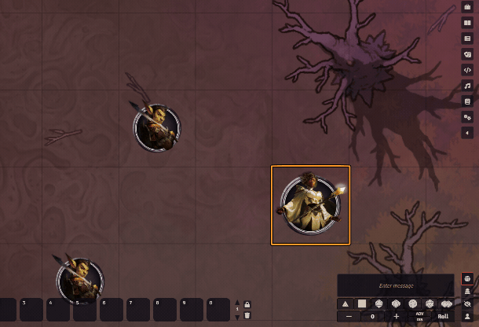

### Macro Activity

The Macro activity executes a macro when the activity is used. Macros can be configured to run automatically or via a chat card button, and receive context including the actor, token, item, targets and usage configuration.

### Move Activity

The Move activity enables forced movement of targeted tokens on the map. Valid movement positions are highlighted based on direction (push, pull, or any) and distance constraints. Supports gridded and gridless scenes, respects wall collision, and handles multiple targets in sequence.

### Swap Activity

The Swap activity swaps the caster's token position with a target token. Supports range validation, target type restrictions (ally, enemy, willing), size limits, and an optional designated actor. Can be configured as a teleport (instant) or animated movement.

### Targeting Prompt

When enabled, the Targeting Prompt intercepts activity usage and prompts the user to select targets on the map before the activity proceeds. A cursor indicator shows the current and required target count. The prompt activates for standard activities with individual target data, as well as Move and Swap activities.

(<a href="#custom-dd-5e">back to top</a>)

---

## Counters

Add counters to character sheets with four types: checkbox, fraction, number and success/failure. 

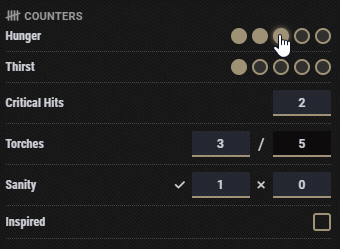

Set triggers to automatically change counter values based on HP thresholds, combat events, or item attack rolls. Triggers can execute macros with custom operators. Counter actions include increasing or decreasing values, destroying items, and reducing item quantities. Counters can also be added to items and group actor sheets, and are compatible with Tidy5e character sheets.

    
See Video

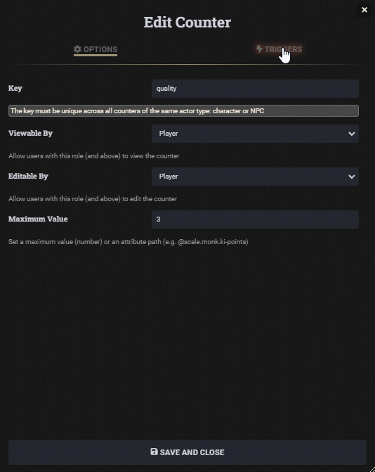

(<a href="#custom-dd-5e">back to top</a>)

---

## Workflows

Create event-driven workflows that execute actions in response to triggers. Workflows can be configured at the world level for actors and items, or per individual actor/item.

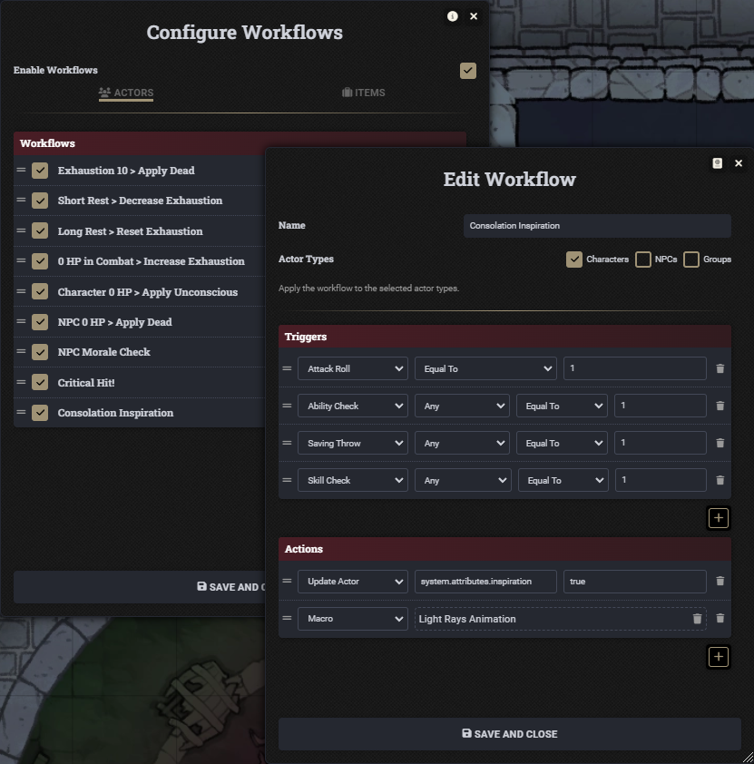
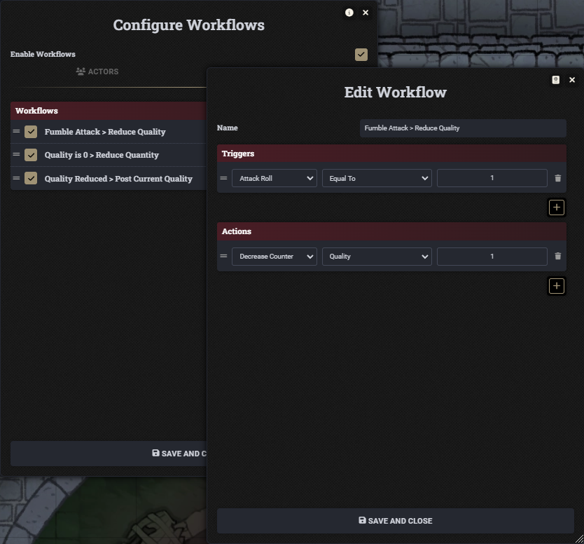

### Triggers

Triggers define when a workflow fires. Multiple triggers can be added to a single workflow using OR logic. Roll-based triggers support optional value conditions with operators (equal, less than, greater than, not equal) and result conditions (success, failure, success/failure within margin, success/failure by amount). Each trigger can also have per-trigger **conditions** — additional state checks (e.g. Custom JavaScript formula, Half HP, a specific condition applied, a counter value) that must all be satisfied on the actor for the trigger to fire.

**Roll Triggers:** Attack Roll, Attack Rolled, Ability Check Rolled, Saving Throw Rolled, Skill Check Rolled, Tool Check Rolled, Initiative Rolled, Concentration Check Rolled, Death Save Rolled, Damage Rolled.

**Hit Point Triggers:** Drops to Zero HP, Reaches Half HP, Loses HP, Gains HP.

**Combat Triggers:** Start of Combat, End of Combat, Start of Turn, End of Turn, Zero HP at Combat End.

**Rest Triggers:** Short Rest, Long Rest.

**Condition Triggers:** Condition Applied, Condition Removed, Condition Level Changed.

**Effect Triggers:** Effect Enabled, Effect Disabled.

**Item Triggers:** Item Equipped, Item Unequipped, Item Used.

**Counter Triggers:** Counter Value Changed, Counter Value Increased, Counter Value Decreased, Counter Checked, Counter Unchecked, Success Value, Failure Value.

### Actions

Actions define what happens when a workflow is triggered. Multiple actions can be added to a single workflow.

**Counter Actions:** Increase Counter, Decrease Counter, Set Counter, Check Counter, Uncheck Counter, Toggle Counter.

**Condition Actions:** Apply Condition, Remove Condition (supports "All" to remove every condition), Toggle Condition.

**General Actions:** Macro, Update Actor, Distribute Award, Play Sound, Request Roll, Roll Table, Update Token.

**Roll Actions:** Add Roll Bonus.

**Workflow Actions:** Enable Workflow, Disable Workflow, Toggle Workflow.

The **Request Roll** action prompts a roll with a configurable DC and supports **On Success** and **On Failure** sub-actions, allowing different actions to execute based on the roll result.

The **Macro** action passes the following properties to the macro script:

| Property | Description |
| --- | --- |
| `actor` | The actor the workflow is running on. |
| `item` | The item the workflow is running on. |
| `event` | Name of the event that fired the workflow (e.g. `counterValueIncrease`, `zeroHp`, `attackRolled`). |
| `userId` | ID of the user who triggered the event. |
| `data` | The hook data from the underlying Foundry hook. |
| `dieTotal` | Die total for roll-based events. |
| `rolls` | Array of `Roll` instances for roll-based events. |
| `counterKey` | Counter key for counter events. |
| `counterName` | Label of the counter for counter events. |
| `counterValue` | New value of the counter for counter events. |

Attack Roll (pre-roll) macros additionally receive `sourceActor`, `sourceToken`, `targetActor`, `targetToken`, `rollConfig`, and `config` for inspecting and modifying the roll before it is made.

### Item Workflows

Item workflows use a subset of triggers (Attack Roll, Item Equipped, Item Unequipped, and Counter triggers) and include additional item-specific actions: Destroy Item, Equip Item, Unequip Item, Update Item and Reduce Quantity.

### Per-Actor and Per-Item Workflows

Workflows can also be configured on individual actors via the Configure Workflows button on the Effects tab of the actor sheet, or on individual items. Per-actor and per-item workflows follow the same trigger and action system as world workflows.

### Copy & Paste

Workflows can be copied and pasted making it easy to duplicate or share workflows.

(<a href="#custom-dd-5e">back to top</a>)

---

## Configurations

Customise D&D 5e system configurations. For help and advice on modifying a configuration, either click the info button in the header of the configuration window or open the Configurations journal within the Custom D&D 5e compendium.

    
See Image

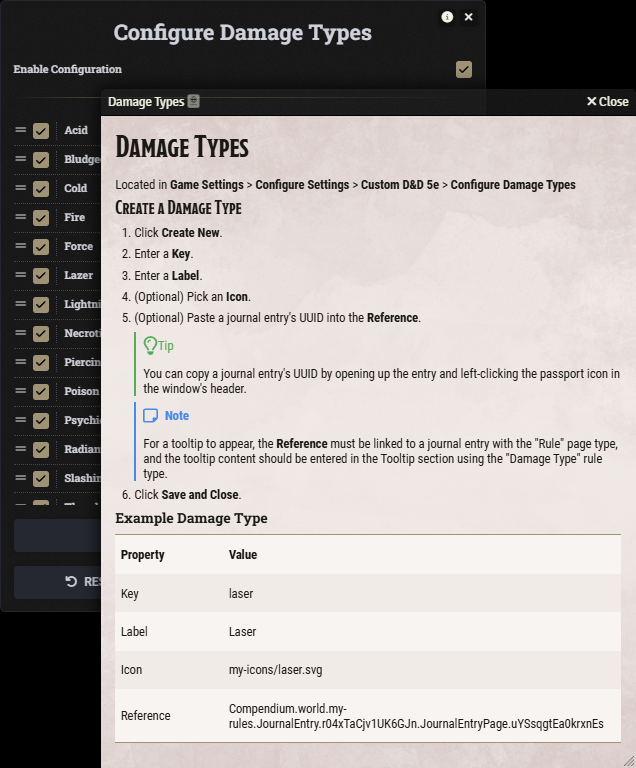

- **Abilities**: Strength, Dexterity, Constitution, etc.
- **Activation Costs**: Action, Bonus Action, Reaction, etc.
- **Actor Sizes**: Tiny, Small, Medium, etc.
- **Armor**: Breastplate, Chain Mail, Leather, etc.
- **Armor Calculations**: Flat, Mage Armor, Unarmored Defense, etc.
- **Armor Proficiencies/Types**: Light, Medium, Heavy, Shields, etc.
- **Bastions**: Facilities, sizes, build orders and subtypes.
- **Calendar**: Custom campaign calendars with months, days and seasons.
- **Conditions/Status Effects**: Blinded, Charmed, Dead, etc. Includes overlay options.
- **Condition effects**: Choose which conditions trigger built-in mechanical effects.
- **Consumable Types**: Ammo, Food, Poison, etc.
- **Creature Types**: Aberration, Beast, Celestial, etc.
- **Currencies**: Copper, Silver, Gold, etc. Includes conversion configuration.
- **Damage Types**: Acid, Bludgeoning, Fire, etc.
- **Encumbrance**: Encumbrance labels, icons, thresholds, weight modifiers, speed multiplier, etc.
- **Equipment Types**: Clothing, Ring, Rod, etc.
- **Feature Types**: Background, Class, Enchantment, etc.
- **Item Properties**: Adamantine, Finesse, Heavy, etc.
- **Item Rarity**: Common, Uncommon, Rare, etc.
- **Languages**: Common, Dwarvish, Elvish, etc.
- **Loot Types**: Art Object, Adventuring Gear, Gemstone, etc.
- **Movement Types**: Walk, Climb, Fly, Swim, etc.
- **Rest Types**: Short Rest, Long Rest, etc.
- **Senses**: Blindsight, Darkvision, Tremorsense, etc.
- **Skills**: Athletics, Acrobatics, Stealth, etc.
- **Spell Schools**: Abjuration, Conjuration, Divination, etc.
- **Tools**: Alchemist's Supplies, Bagpipes, Brewer's Supplies, etc.
- **Tool Proficiencies/Types**: Artisan's Tools, Gaming Set, Musical Instrument, etc.
- **Weapons**: Dagger, Longsword, Shortbow, etc.
- **Weapon Masteries**: Customise weapon mastery effects and labels.
- **Weapon Proficiencies/Types**: Improvised, Simple, Martial, etc.
- **Max Ability Score**
- **Max Level**

(<a href="#custom-dd-5e">back to top</a>)

---

## Configure Encumbrance

Customise encumbrance labels, icons, thresholds and weight modifiers. Includes an optional speed multiplier for encumbrance-based movement reduction.

    
See Image

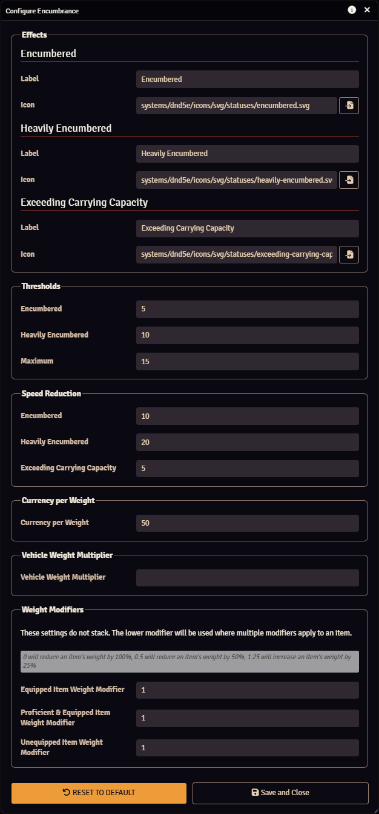

(<a href="#custom-dd-5e">back to top</a>)

---

## Configure Interface

Group of UI and canvas settings for tokens, canvas overlays, and chat. Includes Token Border Shape, Radial Status Effects, Token HUD Improvements, Token Distance, Apply Elevation to Selected Tokens, Toggle Status Effects on Selected Tokens, Ruler Travel Time, Show Pressed Keys, and Chat Commands.

For help and advice on interface settings, either click the info buttons in the Configure Interface window or open the Interface journal within the Custom D&D 5e compendium.

(<a href="#custom-dd-5e">back to top</a>)

---

## Configure Rolls

Customize the base die and roll mode for Ability Checks, Attack Rolls, Concentration Saving Throws, Initiative Rolls, Saving Throws, Skills Checks and Tool Checks.

    
See Video

(<a href="#custom-dd-5e">back to top</a>)

---

## Actor Sheet

Customise the actor sheet with client and world settings for characters and NPCs.

### Client Settings
- **Sheet Scale:** Change the scale of the character sheet.
- **Auto-Fade:** Automatically fade out the actor sheet when the mouse leaves it.
- **Auto-Minimise:** Automatically minimise the actor sheet when the mouse leaves it.

### Characters
- **Banner Image:** Select an image to use as the banner on the character sheet.
- **Show/Hide Death Saves:** Show or hide death saves tracking on the character sheet.
- **Show/Hide Encumbrance:** Show or hide the encumbrance bar on the character sheet.
- **Show/Hide Exhaustion:** Show or hide exhaustion tracking on the character sheet.
- **Show/Hide Inspiration:** Show or hide the Inspiration button on the character sheet.
- **Show Jump Distance:** Display Long Jump and High Jump distances in the Speed tooltip on character sheets. Shows running and standing variants calculated from the character's Strength score and modifier.
- **Show/Hide Manage Currency:** Show or hide the Manage Currency button on the character sheet.

### NPCs
- **Show Disposition:** Show disposition buttons (Secret, Hostile, Neutral, Friendly) in the NPC sheet sidebar for quick token disposition changes.
- **Show/Hide Legendary Actions:** Show or hide Legendary Actions on the NPC sheet.
- **Show/Hide Legendary Resistance:** Show or hide Legendary Resistance on the NPC sheet.
- **Show/Hide Use Lair Action:** Show or hide the Use Lair Action button on the NPC sheet.

### Open / Detach
Automatically open actor sheets as detached windows or when a token is selected, with options to limit the behaviour to chosen actor types and add toggle buttons to the scene controls.

(<a href="#custom-dd-5e">back to top</a>)

---

## Item Sheet

Set the minimum role required to toggle Identified/Unidentified on the item.

(<a href="#custom-dd-5e">back to top</a>)

---

## Item Interactions

Configure how players exchange items in play. Give items directly to other characters, or drop them onto the canvas to be picked up.

### Give Items

Give an item to another character by dragging it onto their token or using the item's context menu, with optional range limits and acceptance prompts.

### Drop Items

Drop items onto the canvas as tokens that other players can pick up, with configurable drop and take ranges, droppable item types, and dropped-token appearance.

    
See Video

(<a href="#custom-dd-5e">back to top</a>)

---

## Smaller Form Character Sheet

Select 'Custom D&D 5e Character Sheet' from the Sheet Configuration dialog (cog on the sheet's header) to enable a smaller form character sheet.

    
See Image

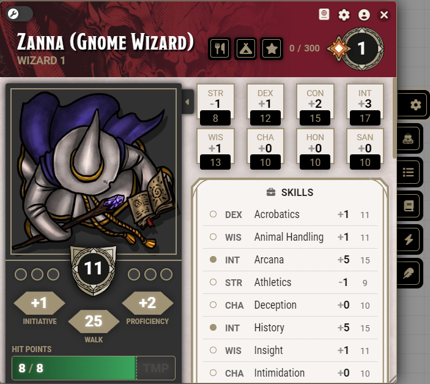

(<a href="#custom-dd-5e">back to top</a>)

---

## Chat Commands

Enable additional chat commands to roll an attack, roll damage or request checks and saving throws. For a list of available commands, view the **Chat Commands** journal within the **Custom D&D 5e** compendium.

    
See Video

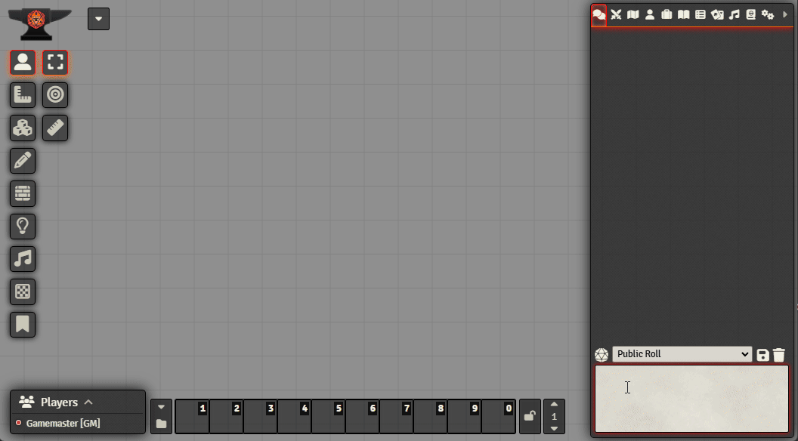

(<a href="#custom-dd-5e">back to top</a>)

---

## Show Pressed Keys

Display an icon near the cursor when the Skip Dialog, Advantage or Disadvantage keys are pressed.

    
See Video

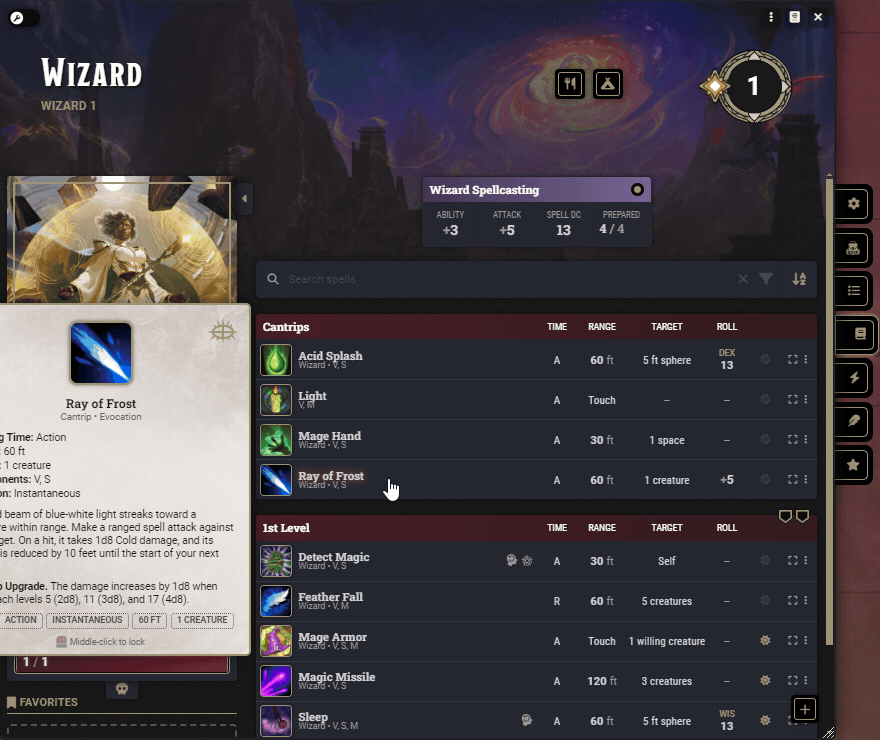

(<a href="#custom-dd-5e">back to top</a>)

---

## Ruler Travel Time

When measuring distances with the ruler tool, travel time estimates are displayed for three D&D 5e travel paces: fast, normal and slow. Times are shown in days, hours and minutes, calculated based on standard 8-hour travel days.

When the ruler is started from a hovered token, the travel time is based on the token's current movement action (Walk, Fly, Swim, etc.) and speed. When started from empty space, the standard 30 feet per round speed is used.

    
See Image

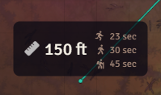

(<a href="#custom-dd-5e">back to top</a>)

---

## Animations

Screen animations can be triggered via the module API or socket events. Available animations include Color Split, Fire, Light Rays, Splatter, and Wave. Animations can also be triggered automatically for events such as Massive Damage and Inspiration.

    
See Video

(<a href="#custom-dd-5e">back to top</a>)

---

## Radial Status Effects

Display status effects in a circle around the token.

### Click to Toggle

When enabled, allows clicking a radial status effect icon to disable it on a left-click or delete on Shift-click. Conditions are always deleted.

    
See Video

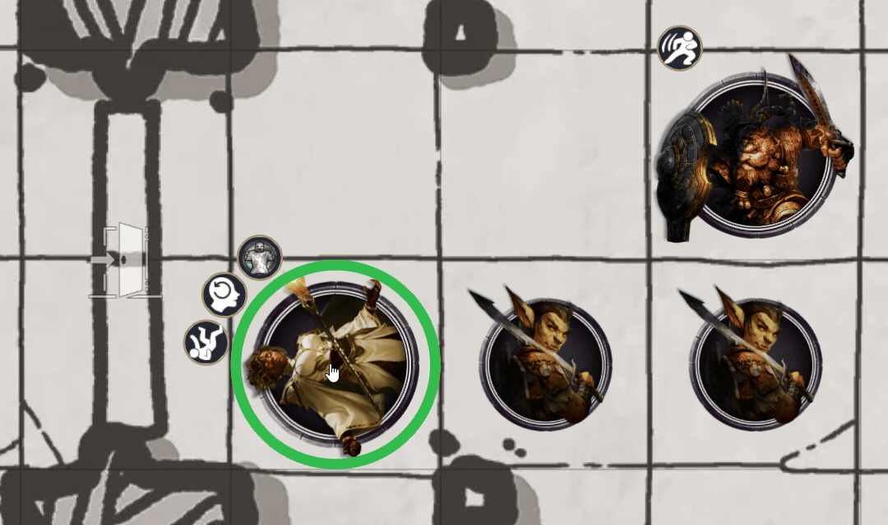

(<a href="#custom-dd-5e">back to top</a>)

---

## Condition Levels

Conditions configured with multiple levels show a clickable level badge on the token, letting you raise or lower the level directly from the Token HUD.

(<a href="#custom-dd-5e">back to top</a>)

---

## Token Border Shape

Choose the shape of the token's border when it is selected or hovered.

    
See Image

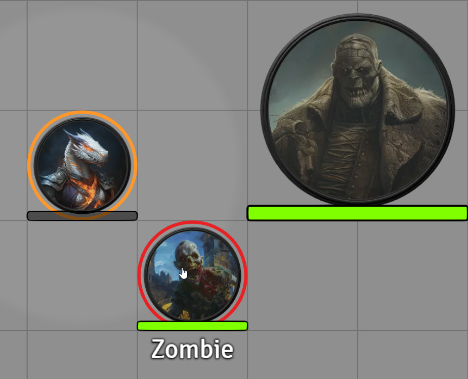

(<a href="#custom-dd-5e">back to top</a>)

---

## Token Distance

Display the distance to a token when hovering over it. Hold the configurable keybinding (Alt by default) to show distances to all visible tokens at once.

The source token is the user's currently controlled token, or the first token of their assigned character.

A minimum role can be configured to control which users see distance labels.

    
See Video

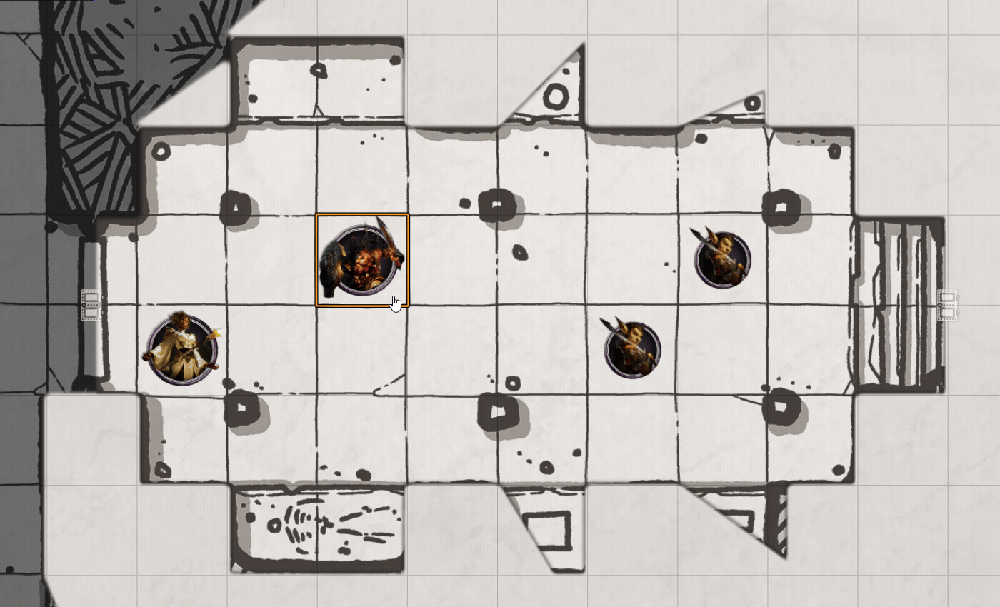

(<a href="#custom-dd-5e">back to top</a>)

---

## Token HUD Improvements

Improves the Token HUD with hover-to-open palettes, button styling, and fixed HUD size across zoom levels.

- **Hover-to-open palettes:** Hovering over the Status Effects or Movement Actions buttons opens the palette automatically.
- **Button styling:** Enhanced visual feedback for status effect icons and control buttons.
- **Fixed HUD size:** The Token HUD maintains a consistent size on screen regardless of the canvas zoom level.
- **Customisable size:** Adjust the overall HUD scale and the number of status-effect rows and columns.

(<a href="#custom-dd-5e">back to top</a>)

---

## Apply Elevation to Selected Tokens

Apply elevation to all selected tokens.

    
See Video

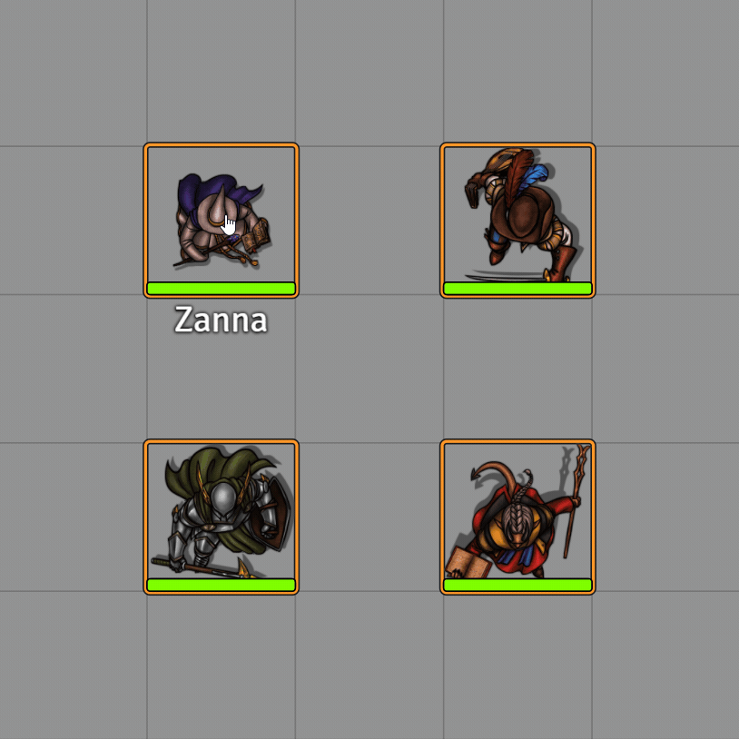

(<a href="#custom-dd-5e">back to top</a>)

---

## Toggle Status Effects on Selected Tokens

Toggle status effects on all selected tokens.

    
See Video

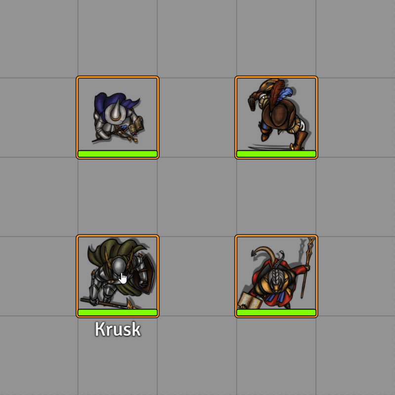

(<a href="#custom-dd-5e">back to top</a>)

---

## Compatibility
### Variant Encumbrance + Midi
Custom D&D 5e will defer to the [Variant Encumbrance + Midi](https://foundryvtt.com/packages/variant-encumbrance-dnd5e) module for encumbrance configuration when it is active.

(<a href="#custom-dd-5e">back to top</a>)

---

## Required Modules
### [libWrapper](https://foundryvtt.com/packages/lib-wrapper)
For developers, LibWrapper is used to patch:
- **`CONFIG.Actor.documentClass.prototype._prepareMovementAttribution`:** Patched when 'Show Jump Distance' is enabled. Appends Long Jump and High Jump distances to the movement tooltip for characters.
- **`CONFIG.Canvas.rulerClass.prototype._getWaypointLabelContext`:** Patched when 'Ruler Travel Time' is enabled. Adds travel time estimates to ruler waypoint labels.
- **`CONFIG.Dice.D20Die.prototype.applyAdvantage`**: Patched when at least one roll is configured. Replaces roll formula to allow different numbers and faces of dice.
- **`CONFIG.Dice.D20Roll.fromConfig`**: Patched when at least one roll is configured. Replaces the d20 die formula with the custom die formula.
- **`CONFIG.Dice.D20Roll.prototype.configureModifiers`**: Patched when at least one roll is configured. Adds the custom die formula to the d20 options to make it available to `validD20Roll`.
- **`CONFIG.Dice.D20Roll.prototype.validD20Roll`**: Patched when at least one roll is configured. Additionally returns true when a custom die exists.
- **`dnd5e.applications.actor.BaseActorSheet.prototype._prepareSenses`:** Patched when senses configuration is enabled. Applies custom senses modifications.
- **`dnd5e.applications.actor.BaseActorSheet.prototype._prepareSkillsTools`:** Patched when skills configuration is enabled. Filters out skills not present in CONFIG.DND5E.skills to prevent errors when skills are injected by the system.
- **`dnd5e.dataModels.actor.AttributesFields.prepareEncumbrance`:** Patched when the D&D 5e's 'Encumbrance Tracking' setting is set to 'Variant'. Avoids recalculating encumbrance as well as issues with encumbrance active effects applied during item updates/deletions.
- **`dnd5e.dataModels.actor.AttributesFields.prepareMovement`:** Patched when encumbrance speed reduction mode is set to 'Multiplier'. Applies multiplier-based speed reductions to movement values.
- **`foundry.canvas.placeables.Token.prototype._refreshBorder`:** Patched when Custom D&D 5e's 'Token Border Shape' setting is enabled.
- **`foundry.canvas.placeables.Token.prototype._refreshEffects`:** Patched when Custom D&D 5e's 'Radial Status Effects' setting is enabled.

(<a href="#custom-dd-5e">back to top</a>)

